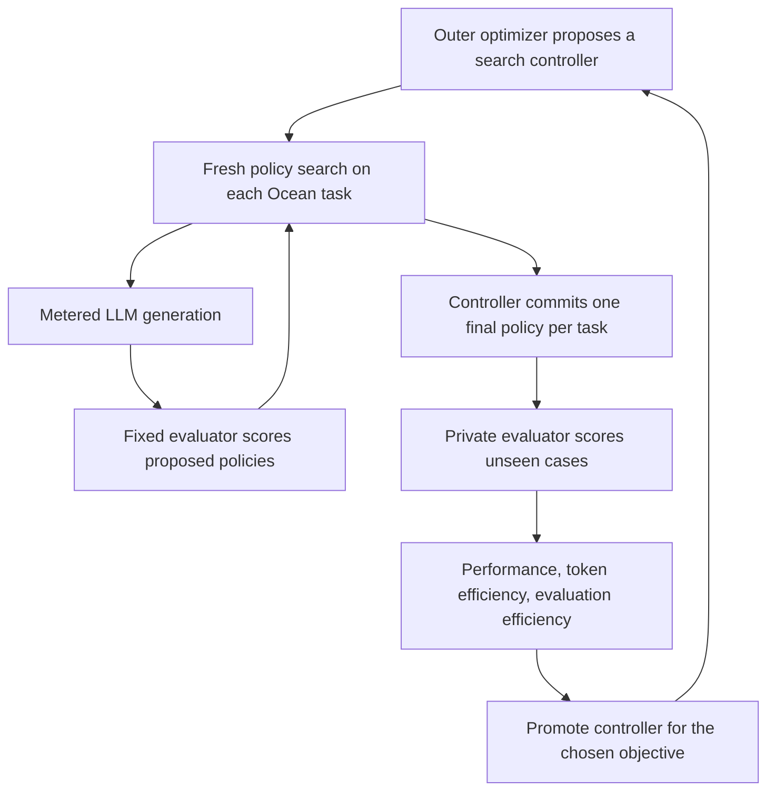

# Ocean meta-experiment: search for better policy searchers

> Implementation update (2026-10-03): evaluation now uses upstream Ocean bindings with batch reset seeds and a fixed horizon. See [the current protocol](OCEAN_BENCHMARK.md). Earlier episode counts, native-version details, and timing projections below are historical.

Status: proposed experiment, 2026-10-02. The [2048 evaluator and search example](OCEAN_BENCHMARK.md)
exist. The multi-environment benchmark, protected scoring boundary and outer
controller search described here are new work. No meta-experiment has run yet.

Update: the [controller-options investigation](OCEAN_CONTROLLER_OPTIONS.md)
recommends GEPA and RRSI as outer optimizers, starting from a simple shared
generate/evaluate/revise controller. EliteTable is an optional reference rather
than the required starting architecture. Earlier revision-count sizing below is
illustrative; engines that reevaluate parents or use validation during selection
must budget those additional complete inner trials too.

## What we are optimizing

The submitted program is a **search controller**: it uses an LLM, proposes game
policies, evaluates them, learns from the results and returns a final policy.
The benchmark measures how good that final policy is on unseen cases, and what
the controller spent producing it. A controller can itself modify its search
strategy during a run; all of that run's generation and evaluation costs count.

An outer optimizer then edits the controller and repeats this experiment. Keep
three separate champions, because the user's objectives need different behavior:

| Track | Maximize | Expected incentive |
| --- | --- | --- |
| Performance | Final normalized total score | Spend available resources wherever they improve policies |
| Token efficiency | Final score / actual output tokens | Write less, reuse useful context, avoid unproductive reasoning and repairs |
| Evaluation efficiency | Final score / evaluated proposals | Think, inspect and plan more before spending an evaluation |

Do not combine these into one weighted reward. Every run returns all three
metrics, but each outer search promotes revisions using its assigned objective.
“At all costs” means no resource penalty in the performance objective; executions
still need declared finite budgets so comparisons finish and are reproducible.



## Fixed tasks and evaluator

Start with three different problems. Bring them online in this order; 2048 alone
is enough to validate the meta-loop, but not enough to claim general search improvement.

| Task | Primary raw score | Proposed frozen configuration | Current status |
| --- | --- | --- | --- |
| Ocean 2048 | Mean conventional merge score | Scaffolding off; fresh lifetime state; external cap 2,000 decisions, preserving earlier native endings | Implemented |
| Ocean Breakout | Mean brick/game score | State observations; frameskip 1; cap 10,000 decisions or native ending | Adapter and parity checks needed |
| Ocean Maze | Fraction of maps solved before timeout | Default dimensions; timeout `2 × width × height`; disjoint map identities across splits | Adapter, map split and episode-memory support needed |

These choices target planning, reactive control and memory. The exact sources are
pinned to PufferLib `6ffa5b10dbbbe4d1e8288367c7d9d3acd3bad4a2`.
Ocean [Breakout](https://github.com/PufferAI/PufferLib/blob/6ffa5b10dbbbe4d1e8288367c7d9d3acd3bad4a2/ocean/breakout/breakout.h)
uses state observations; its scores are not comparable to pixel Atari results.
Ocean [Maze](https://github.com/PufferAI/PufferLib/blob/6ffa5b10dbbbe4d1e8288367c7d9d3acd3bad4a2/ocean/maze/maze.h)
selects from a generated map bank: different episode seeds alone do not establish
unseen maps. Its adapter must also count goal/timeout endings exactly once.

Freeze source/config hashes, compiler, platform, policy runtime and observation
contract. Give every controller the same task documentation and starter policies.
Allow Python/NumPy policies and bounded per-episode memory, reset between cases;
memory must follow the episode when active batch rows change. The initial 2048
pilot retains its existing stateless contract. A policy receives observations
and its own memory, never seeds, simulator pointers or scoring state. No LLM calls
are allowed while playing a final game.

Use four candidate workers, one numerical-library thread per worker, and a fixed
four-core/eight-GiB execution allocation. Start with the current 60-second panel
deadline; qualify each added task against it before freezing the suite. Apply
the same policy compute limits during search and final scoring. Report timeouts,
policy inference cost and external truncation rates, not just successful scores.

The mutable controller may change prompts, parent selection, mutation/remix
operators, population sizes, archive management, scheduling and stopping. The
model/version, available tools, evaluator, task definitions and accounting remain
fixed. This first league uses one fixed model; changing models is a separate league.

## A benchmark call

Conceptually, the runner accepts:

```text
benchmark(controller_source, objective, budget, split, replicate_seeds)
    -> per-task final scores, S, T, E, objective values, complete ledger
```

For every task and independent search replicate:

1. Start the controller with the common starter policy and an empty search archive.
2. Provide a metered LLM gateway and `evaluate(policy_source)` oracle. The oracle
   scores one candidate on a fixed panel of **10 episode seeds/maps**. All competing
   controllers in that replicate receive the same panel and task resources.
3. Let the controller generate, evaluate and revise policies until it stops or
   reaches a budget. Feedback includes all ten scores, failures and useful timing.
4. Require a committed incumbent after each accepted improvement. On budget
   exhaustion or controller failure, retain the last committed valid incumbent;
   if none exists, use the common starter. Do not discard failed search runs.
5. Freeze that policy and evaluate it on **512 private cases**. Return this score
   to the benchmark runner, never to the inner search. There is no free private
   finalist-selection stage: the controller must choose using its search feedback.

The controller starts fresh on each task and replicate. Algorithm code, prompts
and learned search rules can survive outer promotion; prior runs' policy archives,
evaluation caches and test-case data cannot be imported into a fresh trial.
Disclose task-specific priors encoded in the controller. Later, holding out an
entire environment provides a stronger transfer test than holding out seeds.

Ten episode seeds are **one policy evaluation**, not ten proposals. Thus the
earlier six-task, 50-candidate, ten-generation example is 3,000 evaluated proposals
and 30,000 games per independent search replicate. A new run with another search
seed is an additional replicate; it is not one of those ten game seeds.

## Scoring the three objectives

Raw game scores cannot be added: merge points, brick points and success fractions
have unrelated scales. Before optimizing controllers, freeze two calibration
anchors per task on a separate calibration panel:

- `B_e`: performance of the common starter policy.
- `H_e`: performance of a frozen reference policy selected by an independent
  best-of-N baseline. Require `H_e > B_e`; choose a better reference if necessary.

These are calibration anchors, not claims of state of the art. Store the policies,
scores and case hashes in the versioned benchmark manifest. Never move the anchors
when a new controller wins; a changed task/anchor set creates a new benchmark version.
Construct the reference with the development budget (100 evaluated proposals and
500,000 output tokens), then measure both committed anchor policies on 512 separate
calibration cases. A task whose reference cannot beat its starter is not ready for
this normalization. A saturated task can still distinguish efficiency; increasing
its difficulty later requires a new version, not moving the goalposts mid-campaign.

For task `e`, search replicate `r`, and private final mean score `R[e,r]`:

```text
g[e,r] = (R[e,r] - B_e) / (H_e - B_e)
S      = 100 × mean over tasks and search replicates of g[e,r]

T = mean over search replicates of total actual output tokens across all tasks
E = mean over search replicates of total evaluated proposals across all tasks

performance objective          = S
output-token objective         = 1,000,000 × S / T
evaluated-proposal objective   = 100 × S / E
```

The units are score points, score points per million output tokens, and score
points per 100 evaluated proposals. `S=100` means matching the frozen reference
on average; scores above 100 remain possible. Preserve negative results below
the starter rather than clipping away regressions. Equal task weights prevent
2048's large numerical scale from dominating the suite. Use the ratio of aggregate
score to aggregate resource usage, not the mean of individual run ratios.

Ratios reward stopping early. Publish the literal ratios, but use a
**quality-qualified efficiency leaderboard**: an entry must achieve `S >= 100`
and must not fall below its starter on any task, averaged across search replicates.
Entries below that floor remain visible as low-quality tradeoffs. The performance
leaderboard has no such eligibility floor. If no entry qualifies, say so.

Also publish score-versus-token and score-versus-evaluation curves at predeclared
budgets. A ratio winner and a highest-score winner answer different questions.
Zero-token or zero-evaluation algorithms belong in an explicit analytic/baseline
category with undefined ratios; do not fabricate infinity by dividing by an epsilon.
These controls discourage winning merely by returning a free starter policy.

For example, suppose three controllers produce:

| Controller | S | Output tokens | Evaluated proposals | S / million tokens | S / 100 proposals |
| --- | ---: | ---: | ---: | ---: | ---: |
| A | 160 | 2,000,000 | 1,000 | 80 | 16 |
| B | 125 | 500,000 | 500 | 250 | 25 |
| C | 140 | 1,500,000 | 200 | 93.3 | 70 |

Assuming the task floors pass, A wins performance, B wins token efficiency and C
wins evaluation efficiency. This is precisely the separation the experiment wants.

A high total does not establish state of the art on every task. Report each raw
task score, the worst normalized task score, and how many matched-configuration
reference records were exceeded. An “all-task SOTA” claim requires separate
credible comparisons on every task under the same observations, horizons and
compute rules. Until those references exist, call a result a benchmark record.

## Count resources outside the controller

**Output tokens (`T`).** Count every actual generated token in the trial: policy
code, explanations, discarded proposals, critiques, repairs, summaries, tool-call
arguments, controller self-edits and auxiliary LLM calls. Include provider-reported
reasoning tokens once, according to the provider's usage schema. Do not add a
reasoning subtotal twice if it is already included in completion tokens. Meter
failed/cancelled requests too; unknown usage makes the exact token-ratio result
unavailable until reconciled. Record input tokens, cost and calls separately.

The current search example's `reserved_tokens` is a conservative input-plus-output
budget reservation. It is **not** `T`. Keep reservations for admission control and
use actual usage for the metric. Fix model and reasoning settings across entries.

**Evaluated proposals (`E`).** Charge one credit when a candidate is admitted to
the ten-case evaluation oracle, before parsing/running it. Malformed programs,
timeouts, duplicate submissions, repairs and reevaluations each cost another
credit. A batch of 50 costs 50; one program on ten seeds costs one. Reusing an
already received score from the controller's archive is free. Internal ideas and
discarded drafts that never call the oracle cost tokens but no evaluation credit;
that freedom is intentional in this track. Log emitted drafts separately when
observable—LLM calls, proposals and evaluations are not interchangeable counts.

All feedback-producing executions of the real environments go through this oracle.
No hidden rollout tool may bypass its ledger. Surrogate modeling and policy
lookahead are allowed within the common compute allocation and are reported as
compute, not invented oracle calls. The fixed final audit costs the benchmark
operator; it is logged separately and excluded from `E` because it gives no inner
search feedback. Invalid final artifacts receive task failure scores, not a free
repair or replacement after private results are known.

The coordinator owns the ledger, model credentials, simulator, seeds and scorer.
Run the controller and generated policy in isolated processes with enforced
filesystem/network boundaries. Policy processes exchange batched observations and
actions with the trusted simulator; mere process separation under unrestricted
shared access is insufficient. The existing cooperative evaluator shares policy
execution and native scoring state and does **not** yet enforce this boundary.
Remeasure throughput after isolation; the earlier 21× figure does not certify it.

## Outer optimization and the recursive comparison

Begin with a simple shared generate/evaluate/revise controller `S0`. Run a separate outer campaign
for each objective, initially with a fixed LLM editor proposing controller edits.
Its feedback is the development benchmark scorecard and resource ledger.

```text
champion = S0
repeat for the predeclared controller-revision budget:
    candidate = editor.revise(champion, development_history, objective)
    result = benchmark(candidate, objective, development_budget, dev, paired_seeds)
    keep candidate if it improves the assigned development objective
freeze the development winner
```

Allow eight proposed revisions per objective for the first campaign, including
syntax failures and rejected edits. Prefer the incumbent on ties. For an
efficiency campaign with no qualified controller yet, promote by `S` until one
qualifies, then use the requested ratio among qualified controllers. Record every
attempt, rather than reporting only the successful lineage.
Cap outer editing at 16,000 output tokens per revision and 128,000 per objective,
with total input capped at ten times those amounts. These editing costs are
additional to the nested policy-search budgets below.

Use three data levels:

| Level | Who sees the score? | Role |
| --- | --- | --- |
| Development | Outer optimizer; inner search sees only its ten-case panel | Repeated controller improvement |
| Validation | Experiment runner after the campaign is frozen | One independent check of each nominated champion and controls |
| Final test | Experiment runner after all choices are frozen | Report once; no further edits or winner selection |

Each level uses fresh inner-search replicates and disjoint search/audit episode
cases; Maze splits use disjoint maps. Validation may establish success or failure,
but does not trigger further tuning in this initial protocol. Retuning creates a
new campaign with new held-out cases. Repeated feedback makes development results
optimistic; the final test is the improvement claim.

First compare independent generation, frozen `S0`, and the three evolved
champions. Independent generation gets no elite sources or scores in its prompts;
the trusted runner can still retain its best candidate.
The testable claims are that the performance champion improves held-out `S`, the
token champion improves qualified `S/T`, and the evaluation champion improves
qualified `S/E`, each relative to frozen `S0` under the same resource
ceilings. A development-only win is not evidence for any of these claims.

Then test **recursive** improvement with a matched outer experiment:

- Fixed-editor arm: `S0`'s revision routine proposes every controller revision.
- Recursive arm: the current promoted controller's revision routine proposes its
  successor, and that routine is itself editable.
- Frozen arm: unchanged `S0`, evaluated on the same final cases.

Use the same starting artifact, base model, history visibility, revision count and
outer token/evaluation ceilings for fixed and recursive arms. Reset inner archives
for every candidate controller trial. Repeat outer campaigns independently before
claiming recursion helps. An LLM improving game policies, or a fixed editor
improving a search program, alone does not establish recursive improvement.

Track controller discovery cost separately from its deployment/search efficiency.
`T` and `E` above measure running the submitted controller, including any self-edits
it performs during that run. Also publish all outer editing and nested benchmark
costs, including losing controllers. For expected reuse across `K` new suites,
report amortized tokens `T + discovery_output_tokens / K` and analogous evaluation
cost; use predeclared `K` values 1, 10 and 100. Do not present cheap deployment as
cheap discovery.

## Concrete starting budgets

These are proposed experimental settings, not measurements or paid-run authorization.
Use equal ceilings across controllers within a comparison; run tasks with separate
budgets so one easy game cannot consume the whole suite's allocation.

| Stage | Tasks | Search replicates per task | Evaluations per task/run | Output-token ceiling per task/run |
| --- | ---: | ---: | ---: | ---: |
| Plumbing pilot | 2048 only | 2 | 50 | 250,000 |
| Outer development, per controller revision | 3 | 2 | 100 | 500,000 |
| Frozen validation | 3 | 3 | 100 | 500,000 |
| Final comparison | 3 | 5 | 500 | 2,500,000 |

All stages use ten search cases per evaluated proposal and 512 private audit cases
per final policy. Stop at either resource ceiling, a two-hour task/run deadline,
or a separately declared spend cap. Set generation concurrency to four. Fix input
limits and cap total input tokens at ten times the output ceiling; a large hidden
input budget must not substitute for “efficient” output generation. Admission
reserves maximum possible usage for in-flight calls before starting them.

The performance track can later run larger budget tiers without changing its
score function. The other tracks can stop early; their unused resources confer
the intended ratio advantage. Assess budget curves with separate predeclared
token limits 100k/500k/2.5M and evaluation limits 10/50/100/500, holding the other
resource at its final-tier ceiling. Do not choose a reported stopping point using
private test performance. Running the entire grid is optional follow-up work,
not a prerequisite for the first end-to-end pilot.

Sizing examples, before repairs beyond the declared credit cap:

- One development controller: `3 × 2 × 100 = 600` evaluations / 6,000 search games,
  plus `3 × 2 × 512 = 3,072` private audit games.
- Three objectives × eight revisions: at most 14,400 evaluations / 144,000 search
  games, plus 73,728 audit games; controls and calibration are additional.
- Five frozen entries (two baselines and three champions), final comparison:
  `5 × 3 × 5 × 500 = 37,500` evaluations / 375,000 search games,
  plus 38,400 audit games.

At the earlier [2048-only measured proxy](ocean-30000-episode-estimate.json),
144,000 search games would scale to roughly **45 minutes of evaluation** on four
workers. This excludes audit games, LLM generation, controller compute and any
new isolation overhead, and assumes the same policy/game costs. It is not a
three-environment runtime estimate. The development token ceilings alone permit
up to 72 million output tokens across 24 revisions, so model generation remains
a substantial separately budgeted experiment. Run the one-task plumbing pilot first.

## Evidence and smallest implementation

The result table contains controller hash/lineage, objective, model, all three
scores, per-task raw scores, actual input/output/reasoning usage, `E`, failed
submissions, wall time, spend, policy runtime and the complete discovery ledger.
Store final policies and per-case results. Compare paired search replicates, and
report uncertainty across independent search runs; 512 games from one search run
are not 512 independent replications of the search algorithm. Bootstrap paired
run-level results for score differences and ratios. Five runs are an initial
estimate; repeat promising results and independently repeat outer campaigns.

Reuse `research/ocean/evaluator.py`, the existing source/Run storage,
and `examples/ocean_search.py` usage events. EliteSearch remains an optional
reference controller. The minimal new work is:

1. A trusted trial runner that resets a controller, enforces actual-token and
   evaluated-proposal ledgers, and audits its single committed winner.
2. Protected policy execution, followed by throughput/parity remeasurement.
3. Breakout and Maze adapters, including episode memory and map-split checks.
4. One outer revision loop with three objective functions and durable scorecards.

Before a paid campaign, verify ledger arithmetic with a scripted provider,
including failed calls and repairs; ensure private scores cannot reach search;
check archive resets and seed/map separation; and run deterministic scalar/batch
parity and failure probes for each admitted environment. No new optimizer
framework, database, distributed scheduler or dashboard is needed for this test.
