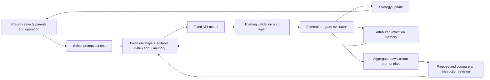

# RSIKit improvement with fixed API models

## Goal and scope

Build reusable components for improving generated programs and the prompts that produce them, while all LLMs remain pretrained API services. This narrows the [agent investigation](../../../outputs/rsikit-improvement-modules-comparison.md) to mechanisms that operate through text, measured outcomes and ordinary host-side search code.

The initial application remains program evolution. A prompt is the control input; the generated program is the artifact evaluated by the task. Improving one program and improving a reusable prompt are separate loops with separate scores. Prompt-only answer tasks can supply a different downstream evaluator once the same boundaries are demonstrated.

This document and its [implementation plan](../plans/2026-09-16-rsikit-api-improvement.md) are planning deliverables. No implementation or paid experiment is part of this planning task.

## Global constraints

- Use fixed pretrained models through injected API providers; no model-weight updates, fine-tuning, soft-prompt embeddings, gradient access or training backends.
- Keep `generate()` / `update()` and the existing two-argument proposal callback compatible.
- Keep task evaluation, execution isolation, run persistence and total budgets application-owned.
- Keep the trusted task objective, evaluator, edit boundaries and output schema outside the editable prompt block.
- Use existing Python, Slick, Pydantic and Jinja dependencies; add no dependency for this work.
- Keep prompt operations in separate local Jinja files; select operations in Python and do not put branches in Jinja.
- Preserve existing strategies' parent sampling, RNG order, admission rules and update timing during extraction.
- Keep fixed model identity and decoding settings within each prompt comparison; record model/settings and rendered prompt provenance.
- Count proposal, critique, repair and prompt-revision calls against the same application-owned call allowance.
- Default new examples to offline scripted verification; live API comparisons are explicit runs, never part of the tests.

## What remains editable

| Control | First implementation | Later compatible extension |
|---|---|---|
| Instructions | An editable instruction/guidance string for each operation, inside a fixed task/output envelope | Component-wise instruction changes and prompt crossover |
| Examples | Selected, measured candidate records already available in history | Successful demonstrations selected from development tasks |
| Feedback | Evaluator diagnostics and comparative reflections | Case-specific failure groups |
| Memory | Bounded, attributed guidance from the current run | Explicitly saved cross-task insights |
| Context selection | Current parent, strategy-selected inspirations and recent outcomes | Outcome-ranked or similarity-based selection |
| Search policy | Existing HillClimb, EoH, AlphaEvolve and DGMArchive | Measured adaptive allocation between operations |

Archive rules and scheduling remain useful without changing model weights: they determine which candidates and experiences reach the prompt. They are host-side algorithms, not training. Evaluating generated programs likewise remains necessary to distinguish useful prompt changes from convincing prose.

## Approach

**Recommended: extend the existing strategy/proposer boundary.** Reuse the current candidate lifecycle, repair wrapper, evaluator and four strategies. Extract prompt operations from the packing example into a reusable proposer; add optional reflection; then add a small explicit outer experiment that compares instruction variants through downstream results.

Two alternatives were considered. A separate prompt-optimization framework would duplicate evaluation, lineage and failure handling before reuse is proven. A universal configurable agent framework would obscure the population and scheduling differences found in the investigation. Neither is needed for this plan.

## Architecture

The outer instruction loop freezes all other comparison inputs. It promotes an instruction only through downstream measurements. In-run reflections can change context without becoming a globally promoted instruction; these two forms of adaptation retain separate records.

### Reusable proposer

Add `PromptProposer` alongside the existing `SlickProposer`, without changing existing consumers. It owns task instructions, provider, per-operation editable instruction strings, named prompt methods and proposal records. Its call returns replacement source just like existing proposers.

Use the existing optional `context=` shape from `PackingProposer`. The experiment supplies it through the existing closure around `strategy.context`; the core strategy callback stays `(parent, history)`. Supported operations initially match current recipes: `mutate`, `INIT`, `E1`, `E2`, `M1`, `M2`, `M3`, `alphaevolve`, and `dgm-archive`. DGM-style diagnosis remains diagnosis plus revision, not executable self-modification.

A shared structured `Draft(description, source)` preserves EoH's idea/code association. The public return remains source text. Proposal records capture the operation, parent/inspiration IDs, editable instruction snapshot, rendered calls and generated draft. Record failed calls before parsing; the experiment relates records to candidate outcomes. Use an attempt record index as well as candidate ID because cancelled generations can reuse the next candidate ID.

The mutable instruction is plain text rendered once. Generated `{{ ... }}` or Jinja directives are not executed as templates. Static task/interface/output rules remain in trusted templates and code checks. This boundary preserves configuration; it does not claim that a model cannot be influenced by conflicting generated text.

### Context and reflection

Context selection is an ordinary function, initially recent completed outcomes, with parents/inspirations explicit and separate. No shared history service, vector store or embedding training.

`ReflectionMemory` generates guidance from a measured parent/child comparison or an explicitly rejected candidate's diagnostics. It records evidence IDs and keeps eight completed reflections by default. It does not turn infrastructure errors into lessons, change fitness, or decide admission. Call it after a completed strategy update or a recorded proposal rejection; a reflection failure leaves the already committed candidate intact and propagates.

Memory is run-local by default. Reset it for independent trials. Reusing memory across tasks is a later, explicit experiment with separate development and test cases.

### Selection and admission

Extract only policies with concrete use: scalar ordering/strict comparison, rank-weighted parent choice, and lineage-aware archive selection. Reuse them in the current concrete strategies while preserving random-number consumption. Keep fixed-cycle EoH, island reseeding and DGM archive admission in explicit strategy code. Export pure decision functions where they actually allow a second recipe to reuse behavior; do not build a registry or configuration graph.

### Instruction evolution

Initially optimize one operation's editable instruction block at a time, starting with `mutate`. The outer loop is a measured hill climb:

1. Use development outcomes to ask the fixed API model for one revised instruction.
2. Evaluate incumbent and challenger over the same identified development cases, repeats, initial states, strategy settings and per-trial allowances. Use fresh strategies and memory.
3. Compare the arithmetic mean of a caller-defined finite, higher-is-better utility on a comparable scale. Count invalid or empty artifact attempts using a declared finite failure utility; never omit them from the denominator.
4. Require strict development improvement. Ties retain the incumbent. Before promotion, evaluate both on a separate selection split and require strict improvement there too.
5. Record both prompt versions and all evidence. Keep a separate final test split completely out of revision and promotion.

The evaluator callback owns task-specific utility, normalization and trial execution. No arbitrary cross-task scores are averaged. The example uses one task family initially. A one-step trial measures proposal quality; a fixed-length inner optimization trial measures optimizer usefulness. Use the first for screening and the second as a later explicit comparison, not interchangeable labels.

The meta-revision call sees development evidence only. Selection scores control promotion but selection artifacts/diagnostics are not fed into rewriting. Repeated selection still adapts to that split, so it is not final test evidence. Repeated API samples estimate variability; matched host seeds do not imply deterministic provider outputs or statistical significance.

### Budget and failure ownership

The experiment wraps the injected provider once to count attempts before dispatch. Pass that same wrapper through generation, diagnosis, reflection, repair and instruction revision. A started failed call still consumes an attempt. The wrapper raises an explicit budget-exhaustion exception before an over-limit request. The runner records an incomplete trial and keeps the incumbent; infrastructure errors abort comparison and retain completed evidence without inventing a low score.

Per-trial call limits and the root limit both apply. The runner stops starting a paired comparison unless it can reserve its configured maximum allowance, including repairs and reflection. Provider-reported usage is recorded when available; otherwise token/currency usage remains unknown, not zero. Existing output-token and timeout settings remain separate limits.

## Research modules retained or removed

| Investigation modules | Decision |
|---|---|
| M1 artifact/edit contract; M5 repair; M6 evaluation | Reuse existing implementation and add explicit prompt-trial evidence only when required |
| M2 selection; M9 admission | Extract reusable decisions without changing strategy semantics |
| M3 context; M4 variation; M7 reflection; M8 memory | Main implementation work |
| M10 scheduling | Preserve current schedules now; adaptive allocation is a follow-on experiment |
| M11 meta-improvement | Retain instruction evolution and mutation-instruction evolution; defer executable self-rewriting |
| M12 training/model update | Remove completely from the implementation scope |

Drop STaR training, EvoPrompting soft-prompt tuning, learned embeddings, weight-based RL and associated infrastructure. EvoPrompting's ordinary target-conditioned text generation may remain an idea donor but is not the full trained method. Eureka's reward-through-policy-training and PINSKY's numeric policy optimization are outside this prompt-focused plan. ReEvo, Reflexion, ExpeL-style text memory, EoH, OPRO, EvoPrompt, GEPA-style component changes and Promptbreeder-style mutation text remain relevant without any weight updates.

## Delivery and success

Deliver in three working increments: reusable prompt/context generation; optional measured reflection plus reusable policy decisions; then downstream-tested instruction evolution. Each increment has offline contract tests and an example. Neither a growing memory nor a successful model-generated rewrite is an improvement claim; only the task evaluator establishes the measured result.

A later empirical comparison should include static revision, fixed EoH operators, reflection on/off and evolved instructions with the same model/settings and declared resource allowance. Report quality, validity, calls, executions, repairs and elapsed time. Keep a frozen baseline and final test cases. No numeric improvement target is asserted before this experiment.
