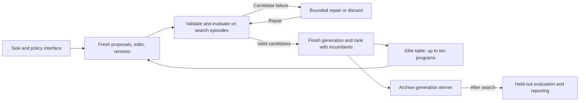

# EliteTable: LLM-Driven Self-Improvement Through Evolutionary Program Search

## Abstract

Can a language model repeatedly improve its own proposed solutions using execution feedback? We investigate this form of self-improvement through EliteTable, an evolutionary program-search procedure that retains a small table of successful programs and uses them to guide fresh proposals, edits, and remixes. Improvement occurs in the generated solutions and retained search context while model weights and the search procedure remain fixed. Six Gymnasium control environments provide a testbed with measurable rewards and separate search and held-out episodes. Exploratory pilots achieved held-out targets on CartPole, MountainCar, and LunarLander. CarRacing's held-out mean reward increased from 159.04 to 595.37 over ten generations, while Acrobot improved but remained below target and BipedalWalker remained far below target. These observations provide initial evidence that an LLM-based system can improve generated solutions through repeated evaluation and reuse, with substantial variation across tasks. Ten independently initialized searches per environment are underway to measure repeatability under a common ten-generation budget. The study examines a simple mechanism for LLM-driven self-improvement through executable, inspectable outputs.

## 1. Introduction

An important question for LLM-based problem solving is whether a system can use the outcomes of its own attempts to produce progressively better solutions. A proposal may be plausible without working well in practice. Execution provides a measurable test, and feeding those measurements and successful programs into later proposals creates an opportunity for improvement through repeated interaction with a task. Understanding how to organize this loop matters for automated problem solving and research.

We study self-improvement at the level of an LLM-based system's generated solutions. The model proposes programs, an external evaluator measures them, and a retained search history supplies context for subsequent proposals. Model weights and the search procedure remain fixed; the programs and the information available to later proposals change. EliteTable investigates how a small table of high-scoring programs can organize this process through fresh proposals, edits, and recombination.

Language-model program search combines a proposal mechanism with execution-based evaluation. FunSearch demonstrated this approach using a pretrained language model, a program skeleton, and an island-based database of evaluated programs. Its results establish a precedent for retaining useful programs and incorporating them into subsequent generation prompts. [FunSearch](https://www.nature.com/articles/s41586-023-06924-6)

AlphaEvolve extends evolutionary code modification to scientific and computational problems, using evaluator feedback to guide further changes. ShinkaEvolve investigates search organization through parent sampling, novelty rejection, and a bandit-based ensemble of language models. These systems share the proposal–evaluation loop but make different choices about the information and mechanisms used to sustain search. [AlphaEvolve](https://arxiv.org/abs/2506.13131), [ShinkaEvolve](https://arxiv.org/abs/2509.19349)

EliteTable examines one bounded elite table and generation-based updates as a mechanism for LLM-driven self-improvement. Control environments serve as the experimental testbed: they provide executable tasks, measurable outcomes, and repeated episodes on which generated solutions can be compared. The paper's central question concerns the improvement process; control-policy performance provides the evidence used to investigate it.

The primary hypothesis is that an LLM-based system can improve the quality of its generated solutions through repeated proposal, evaluation, and reuse of successful attempts. In this testbed, we operationalize that hypothesis as increased held-out reward within a ten-generation search budget. For each independent search, improvement is the held-out mean reward of its generation-ten winner minus that of its generation-one winner. The prediction is a positive median paired change within each environment.

Early saturation may affect this prediction: a generation-one winner can already reach the reward ceiling. Such an outcome demonstrates initial solution quality; a positive later change provides evidence of improvement through continued search. This distinction is essential when evaluating self-improvement, because solving a task immediately does not by itself demonstrate improvement over successive attempts.

The study introduces a simple, reproducible mechanism for LLM-driven self-improvement and examines what it accomplishes across six control environments. It measures changes in solution quality on episodes excluded from selection and documents target attainment, plateaus, failures, resource use, and changes in generated programs. Comparative benchmarking, component ablations, and evaluation in other problem domains remain follow-up work.

## 2. The EliteTable Method

### 2.1. Candidate programs and evaluation

EliteTable represents candidate solutions as executable programs and uses their measured task performance to guide subsequent proposals. In the present experiments, each program is a control policy operating in a simulated environment. A policy implements `Solution(Policy)` and maps observations to valid actions. It may maintain internal state, reset between episodes, and use a supplied seeded random generator. The policy does not receive an environment object or a reward stream; the evaluator accumulates rewards externally. [Policy contract](../companion/elitesearch/prompts/context.j2)

For a policy and episode seed, return is the undiscounted sum of rewards until termination or the registered episode limit. The arithmetic mean across ten search episodes determines ranking; the mean across one hundred held-out episodes measures the selected policy on episodes excluded from selection. Higher reward is better, including when rewards are negative.

### 2.2. Elite retention and candidate generation

The first generation starts with fifty fresh proposals. After all candidate slots finish evaluation or exhaust their repair allowance, the ten highest-scoring valid programs from the existing table and new candidates become the next elite table. Incumbents remain eligible, so the best retained search score cannot decrease across completed generations with a valid incumbent. This retention property does not guarantee improvement on held-out episodes.

Subsequent generations ordinarily contain ten fresh proposals, twenty edits, and twenty remixes. Edit parents are sampled uniformly from the elites; remixes sample up to three distinct elites. All candidates in a generation use the preceding table, which remains unchanged until promotion. An empty table triggers fresh proposals throughout; with one elite, remix slots become edits. Later fresh proposals receive elite summaries, so they are also informed by search history. [Search and operator implementation](../companion/elitesearch/agent.py)

Fresh proposals generate complete programs. Edits return source replacements for one parent; remixes generate a complete program using several parents as context. Edit and remix prompts include parent code and measured search rewards. The elite table therefore supplies persistent context across model calls: later proposals can draw on programs the system generated and tested earlier.

```text
elites = empty
for generation in 1..10:
    allocate 50 slots and sample parents from current elites
    propose, validate, and evaluate each candidate on search episodes
    repair candidate failures up to five times; record unresolved discards
    retain the best 10 from previous elites and valid new candidates
    save the winner, source, lineage, measurements, and calls
after search:
    evaluate distinct recorded winners on held-out episodes
    report outcomes without changing the selected winners
```



**Figure 1.** The self-improvement loop: the LLM proposes programs, execution supplies feedback, and the elite table retains measured solutions for later proposals. Held-out evaluation is a separate reporting phase.

### 2.3. Validation, repair, and execution

Generated outputs undergo structured-output and static source checks before execution. Python abstract syntax trees are compared within each search to reject duplicate accepted source structures. Malformed output, invalid edits, duplication, and candidate execution failures enter a shared repair loop, with at most five repair calls per candidate slot. Unresolved slots are discarded; infrastructure failures interrupt the run rather than receiving an artificial reward. The slot budget therefore differs from the number of model calls and evaluated source revisions. [Validation](../companion/alphaevolve/edits.py), [repair prompt](../companion/elitesearch/prompts/repair.j2)

Policies execute in the separate-process Docker backend with networking disabled, a read-only root filesystem, and resource limits. The frozen main configuration allows four episode workers and ten seconds per policy call and per episode result. Timeouts are failures, not rewards of zero. Source, repairs, measurements, and call records are checkpointed to preserve evidence across interrupted attempts. [Execution backend](../companion/rsikit/sandbox/docker.py)

## 3. Experimental Setup

### 3.1. Control environments as a testbed

The six control environments instantiate the same problem-solving loop with different observations, actions, and reward functions. They allow changes in generated solution quality to be measured across generations and evaluated on episodes excluded from selection. EliteTable uses `EliteSearch`; the language model receives task documentation, the policy interface, and operator-specific context while its weights remain fixed. Native Gymnasium observations are supplied directly to policies, including 96×96 RGB images for CarRacing. [Implementation](../companion/elitesearch/agent.py), [runner](../companion/examples/elitelist_papers/run.py)

| Material or setting | Specification for the main experiment |
| --- | --- |
| Model | `openai/gpt-oss-120b:nitro`, accessed through OpenRouter |
| Environment package | Gymnasium 1.3.0; installed task profiles and registered episode limits |
| Environments | CartPole-v1, MountainCar-v0, Acrobot-v1, LunarLander-v3, BipedalWalker-v3, CarRacing-v3 |
| Search budget | Ten generations; fifty new candidate slots per generation; up to ten retained elites |
| Proposal mixture | Generation one: all fresh; subsequent generations: 20% fresh, 40% edits, 40% remixes |
| Repair allowance | At most five repair attempts per candidate slot |
| Evaluation panels | Ten search episodes; one hundred held-out episodes per winner |
| Execution limits | Ten seconds per policy call and per episode result; four episode workers |

**Table 1.** Main-experiment settings from the frozen protocol; exploratory pilot execution histories differ.

Detailed settings are preserved in the [study configuration](../companion/study.json) and [frozen protocol](../companion/examples/elitelist_papers/PROTOCOL.md); Appendix A links the reproducibility materials.

### 3.2. Search budget and replication

A **candidate** is one proposed policy within a search. An **episode** is one evaluation of a policy under an environment seed. An **independent search** is a separately initialized sequence of generations and is the unit of replication. The main experiment comprises ten searches per environment, sixty in total. Multiple episodes improve a policy's measurement but do not constitute independent search replicates.

Each complete main search schedules fifty new candidate slots per generation for ten generations, or five hundred slots in total. Ten retained elites persist across generations; repairs are additional calls within the scheduled slots.

The main experiment measures changes within each search over a fixed ten-generation budget. Search initialization seeds are 0–9. Every candidate is scored on the same ten environment episode seeds, also numbered 0–9. After search, the selected generation winners are evaluated on held-out seeds 1000–1099. These differ from the inspected pilot panel, seeds 100–199. Held-out results do not influence proposals, repairs, or winner selection. Targets are reporting thresholds and do not stop the main searches.

### 3.3. Performance measures and analysis

The primary outcome is the median paired generation-ten-minus-generation-one change, separately for each environment. A descriptive 95% percentile bootstrap interval will use 10,000 resamples of whole search identities. Learning curves will show individual trajectories, medians, interquartile ranges, and valid-search counts. Raw reward differences will not be pooled across tasks with different scales.

All planned searches remain in the inventory, including failures and missing evaluations. Missing rewards are not replaced with zero; incomplete endpoint pairs cannot contribute to the primary paired estimate. The pilots have different stopping points and execution histories and therefore provide exploratory observations separately from this analysis. [Analysis protocol](../companion/examples/elitelist_papers/PROTOCOL.md)

## 4. Results

### 4.1. Task performance and target attainment

The archived pilots achieved held-out targets on CartPole, MountainCar, and LunarLander. CartPole reached a mean of 500 in its first generation; MountainCar and LunarLander exceeded their targets by generations two and nine, respectively. Acrobot finished narrowly below its target, while CarRacing and BipedalWalker remained further below theirs. Table 2 summarizes the available endpoints. Results from the ongoing replicated main experiment are not included here.

| Environment | Displayed searches (n) | Final generation | First held-out mean | Final held-out mean | Change | Target | Final target attained |
| --- | ---: | ---: | ---: | ---: | ---: | ---: | --- |
| CartPole-v1 | 1 | 1 | 500.00 | 500.00 | 0.00 | 475 | Yes |
| MountainCar-v0 | 1 | 2 | −116.79 | −102.17 | +14.62 | −110 | Yes |
| Acrobot-v1 | 1 | 4 | −137.53 | −102.42 | +35.11 | −100 | No |
| LunarLander-v3 | 1 | 9 | −67.39 | 213.95 | +281.34 | 200 | Yes |
| CarRacing-v3 | 1 | 10 | 159.04 | 595.37 | +436.33 | 900 | No |
| BipedalWalker-v3 | 1 | 10 | Unavailable | −8.17 | Unavailable | 300 | No |

**Table 2.** Descriptive pilot outcomes; each available mean uses one hundred held-out episodes. Changes use unrounded means and compare generation one with the reported endpoint, which is not uniformly generation ten. Each row represents one search, with no between-search confidence interval. MountainCar denotes `pilot-MountainCar-v0-1`; an earlier failed MountainCar pilot remains in the inventory and lacks a final held-out result. Sources: archived curves for [CartPole](../runs/pilot-CartPole-v1-0/curves.csv), [MountainCar](../runs/pilot-MountainCar-v0-1/curves.csv), [Acrobot](../runs/pilot-Acrobot-v1-0/curves.csv), [LunarLander](../runs/pilot-LunarLander-v3-0/curves.csv), [CarRacing](../runs/pilot-CarRacing-v3-0/curves.csv), and the [BipedalWalker summary](../runs/pilot-BipedalWalker-v3-0/summary.json).

### 4.2. Improvement across generations

The completed MountainCar pilot improved from −116.79 to −102.17 by generation two. LunarLander improved by 281.34, and CarRacing by 436.33 between its first and tenth generations. Acrobot gained 35.11 while remaining slightly below target. CartPole had already reached its episode reward ceiling in generation one, leaving no observed improvement to measure.

Held-out progress was not uniformly monotonic. CarRacing reached approximately 627 in generation seven before ending at 595.37. Its generation-five and generation-six held-out panels are incomplete. Figure 2 preserves these gaps and separates search scores from held-out outcomes. These endpoint changes describe individual pilots; the differing stopping points prevent treating every row as a generation-one-to-ten test.


**Figure 2.** Pilot reward trajectories: blue dashed lines show search means, orange solid lines held-out means, and green dotted lines reporting targets. Missing held-out evaluations remain gaps; BipedalWalker shows only its final held-out measurement. These are individual exploratory searches, not averages over the ongoing ten-search groups.

### 4.3. Changes in generated solutions: CarRacing

CarRacing was selected as a case study because its exploratory trajectory showed substantial improvement. Archived source reveals increasingly elaborate observation processing and control:

| Winner checkpoint | Observed implementation |
| --- | --- |
| Generation 1: [GreenDiffSteeringPolicy](../runs/pilot-CarRacing-v3-0/exports/e40fa10688c24cefac792254416648cd1d46e0d34fc8d01a91973726131ea787_GreenDiffSteeringPolicy.py) | Steering from the difference in mean green intensity between image halves; fixed throttle of 0.5 and no braking. |
| Generation 5: [HybridPDLuminancePolicy](../runs/pilot-CarRacing-v3-0/exports/83897571b9247dc5cecc8c0c0d46f0f03e507439f8e0acc93db549d90f911779_HybridPDLuminancePolicy.py) | Luminance-based masking, proportional–derivative steering, exponential smoothing, and adaptive throttle; produced by remixing candidates 192, 151, and 179. |
| Generation 10: [EnhancedSteeringAndThrottle](../runs/pilot-CarRacing-v3-0/exports/70fe65f0b7d5610ab2fd3f92d70f806e85070de3488b9496abaf6f5e10660655_EnhancedSteeringAndThrottle.py) | Green-intensity differences and a green-threshold centroid, seven-step history smoothing, adaptive throttle and braking; a generation-eight edit of candidate 328 retained through generation ten. |

**Table 3.** Selected winner programs from the [CarRacing archive](../runs/pilot-CarRacing-v3-0/run.sqlite). These checkpoints are not a direct parent–child chain. The generation-five held-out result is unavailable. Mask definitions show what pixels the code selects; comments alone do not establish accurate road identification or explain reward gains.

### 4.4. Failures and resource use

An earlier MountainCar pilot failed overall and lacks a final held-out result; it remains visible in the pilot inventory. CarRacing and BipedalWalker completed ten search generations but retain failed overall reporting status. Their available measurements are reported alongside these limitations. CartPole's episode timeout changed from 60 to 10 seconds on resume, alongside a worker-count change. The pilot histories therefore differ from the fixed main protocol. [Pilot inventory](../figures/target-and-progress.csv), [CartPole attempt history](../runs/pilot-CartPole-v1-0/attempts.json)

Recorded calls exceed candidate slots because of repairs:

| Pilot | Candidate slots | Recorded calls | Repair calls | Discarded slots | Recorded attempt minutes |
| --- | ---: | ---: | ---: | ---: | ---: |
| CartPole | 50 | 98 | 48 | 0 | 4.05 |
| MountainCar (`-1`) | 100 | 111 | 11 | 0 | 4.18 |
| Acrobot | 200 | 235 | 35 | 0 | 11.71 |
| LunarLander | 450 | 523 | 73 | 0 | 22.39 |
| CarRacing | 500 | 587 | 87 | 1 | 97.76 |

**Table 4.** Counts use the final exported search checkpoints linked beside Table 2; repair calls are included in recorded calls. Recorded durations sum attempt `elapsed_seconds`, including failed attempts and reporting time, excluding gaps between attempts: [CartPole](../runs/pilot-CartPole-v1-0/attempts.json), [MountainCar](../runs/pilot-MountainCar-v0-1/attempts.json), [Acrobot](../runs/pilot-Acrobot-v1-0/status.json), [LunarLander](../runs/pilot-LunarLander-v3-0/attempts.json), and [CarRacing](../runs/pilot-CarRacing-v3-0/attempts.json). These are not isolated search timings or a controlled speed comparison. BipedalWalker checkpoint accounting is unavailable in this summary. Monetary costs remain unreconciled, not zero; the final study will report available billing data.

## 5. Discussion

The central observation is that the LLM-based system produced better-performing solutions over successive generations in several pilot searches. MountainCar, Acrobot, LunarLander, and CarRacing improved on held-out episodes, providing evidence of solution improvement beyond the search panel. CartPole demonstrates strong initial solution quality, while BipedalWalker shows that the same loop can fail to produce an effective solution. These outcomes distinguish the ability to generate a successful answer from the ability to improve through repeated attempts.

These observations support the feasibility of LLM-driven self-improvement through generated programs and external evaluation. They are consistent with the hypothesis in individual searches, while the ongoing experiment will test the predicted median generation-one-to-ten change across independent searches under a common budget. The current design evaluates the complete procedure. Determining how much improvement comes from reusing earlier solutions requires a budget-matched independent-generation comparison; identifying the contributions of editing, remixing, or retention requires ablations.

EliteTable makes this improvement process inspectable. Retained source and lineage show what the system produced, which earlier attempts informed a proposal, and how program structure changed. The CarRacing example illustrates increasingly elaborate generated solutions, although source inspection alone cannot establish which changes caused the reward gains. Improvements remain in the generated programs and retained context; the experiment does not measure an increase in the underlying model's capabilities or modification of the search algorithm itself.

The CarRacing trajectory also shows why evidence of self-improvement requires more than rising retained search scores. Elite retention guarantees a nondecreasing best search score under stored measurements, but performance on held-out episodes can regress. Independent evaluation is therefore central to assessing whether repeated attempts produce better solutions beyond the episodes used to select them.

The evidence concerns familiar benchmark tasks supplied with documentation, so success may draw on known control strategies in the model's prior knowledge. Held-out seeds assess new episodes within the same task profiles, not unfamiliar tasks or changed dynamics. Control environments provide a concrete test of the improvement loop, but broader applicability to automated problem solving and research requires experiments in other domains. Pilot-guided task emphasis and differing execution histories further limit generalization from these exploratory results.

The final repeated-search results will clarify consistency, variability, and failure frequency. Subsequent budget-matched comparisons, operator ablations, unfamiliar problem domains, and complete resource accounting can test which mechanisms support improvement and at what cost. This positions EliteTable as a simple system for studying how an LLM can use the measured outcomes of its own proposals to guide further problem solving.

## 6. Conclusion

EliteTable studies LLM-driven self-improvement through a loop of program generation, external evaluation, and reuse of successful attempts. Control environments provide the testbed: exploratory pilots show both successful initial solutions and improvements in held-out performance over successive generations, alongside plateaus and failures. The ongoing sixty-search experiment will measure the consistency of these observations. The contribution is a simple, inspectable procedure and initial evidence that an LLM-based system can improve its generated solutions through measured feedback while keeping model weights fixed.

## References

1. Romera-Paredes, B., et al. (2024). *Mathematical discoveries from program search with large language models*. Nature, 625, 468–475. Published online December 2023. [Article](https://www.nature.com/articles/s41586-023-06924-6).
2. Novikov, A., et al. (2025). *AlphaEvolve: A coding agent for scientific and algorithmic discovery*. arXiv:2506.13131. [Paper](https://arxiv.org/abs/2506.13131).
3. Lange, R. T., Imajuku, A., and Cetin, E. (2025). *ShinkaEvolve: Towards Open-Ended and Sample-Efficient Program Evolution*. arXiv:2509.19349. [Paper](https://arxiv.org/abs/2509.19349).
4. EliteTable companion artifact. *Frozen protocol and archived experimental evidence*. [Protocol](../companion/examples/elitelist_papers/PROTOCOL.md), [study configuration](../companion/study.json), [pilot inventory](../figures/target-and-progress.csv).

## Appendix A. Reproducibility Details

The companion preserves the implementation and experiment inputs: [search agent](../companion/elitesearch/agent.py), [candidate records](../companion/elitesearch/records.py), [runner](../companion/examples/elitelist_papers/run.py), [policy contract](../companion/elitesearch/prompts/context.j2), and prompts for [fresh proposals](../companion/elitesearch/prompts/new.j2), [edits](../companion/elitesearch/prompts/edit.j2), [remixes](../companion/elitesearch/prompts/remix.j2), and [repairs](../companion/elitesearch/prompts/repair.j2). Dependency and execution details are recorded in [pyproject.toml](../companion/pyproject.toml), [uv.lock](../companion/uv.lock), and [worker-environment.json](../companion/worker-environment.json). The [release record](../companion/FREEZE.md), [source provenance](../companion/SOURCE_PROVENANCE.json), and [artifact inventory](../companion/ARTIFACTS.json) identify the archived preparation.

The [companion instructions](../companion/README.md) distinguish offline regeneration of tables and figures, reevaluation of saved policies, and new language-model searches. These are different reproducibility checks: hosted-model generation can produce new programs even with unchanged requested settings. Main analysis uses the [archived analysis implementation](../companion/tools/results.py); full prompts, resolved environment settings, actual provider metadata, attempt histories, and missing-evidence reasons accompany each run.
