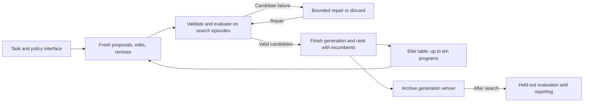

# EliteTable — Expanded Paper Outline

*Expanded from the twelve-question Level 2 outline. Empirical findings below describe archived exploratory pilots. Ten independently initialized searches per environment are underway for the final paper.*

## Introduction

### 1. Why is your research important?

Developing effective control policies requires choosing an approach, implementing it, measuring its behavior, and revising it after unsuccessful trials. Automating parts of this process could reduce the manual effort needed to explore candidate solutions. A language model can propose executable programs, while an external evaluator supplies performance measurements that guide subsequent proposals. The resulting program can then act without further language-model calls.

This raises a practical research question: how should a search retain and reuse its successful programs? EliteTable investigates a simple answer. It keeps a small table of high-scoring policies and generates new candidates through fresh proposals, edits, and recombination. Studying this procedure makes its behavior accessible: the selection rule, evaluation budget, retained programs, and successive code changes can all be inspected.

### 2. What is known about the topic?

Language-model program search combines a proposal mechanism with execution-based evaluation. FunSearch demonstrated this approach using a pretrained language model, a program skeleton, and an island-based database of evaluated programs. Its results establish a precedent for retaining useful programs and incorporating them into subsequent generation prompts. [FunSearch](https://www.nature.com/articles/s41586-023-06924-6)

AlphaEvolve extends evolutionary code modification to scientific and computational problems, using evaluator feedback to guide further changes. ShinkaEvolve investigates search organization through parent sampling, novelty rejection, and a bandit-based ensemble of language models. These systems share the proposal–evaluation loop but make different choices about the information and mechanisms used to sustain search. [AlphaEvolve](https://arxiv.org/abs/2506.13131), [ShinkaEvolve](https://arxiv.org/abs/2509.19349)

EliteTable examines one bounded elite table, generation-based updates, and an explicit mixture of proposal operators. The present study describes this implementation and its observed behavior on control tasks. It does not establish a ranking against those systems or attribute any performance difference to their architectural choices.

### 3. What are your hypotheses?

The primary hypothesis is that repeated proposal, evaluation, and reuse of elite policies improve held-out reward within a ten-generation search budget. For each independent search, improvement is defined as the held-out mean reward of its generation-ten winner minus that of its generation-one winner. The prediction is a positive median paired change within each environment.

Task difficulty and early saturation may affect this prediction. A generation-one winner can already reach the task's reward ceiling, leaving no measurable room for improvement. Such an outcome demonstrates immediate policy-generation success, while a positive later change demonstrates improvement through continued search. The pilots provide examples of both; repeated searches will determine how consistently they occur.

### 4. What are your objectives?

The study aims to describe EliteTable reproducibly, evaluate executable policies across six control environments, and characterize their performance on episodes excluded from search selection. It documents target attainment, improvement, plateaus, unsuccessful searches, and resource use. Selected programs illustrate how policy implementations differ across generations. Comparative benchmarking and component ablations are reserved for follow-up studies; the present objective is to establish what the complete procedure accomplishes under a defined budget.

## Materials and Methods

### 1. What materials did you use?

EliteTable uses the `EliteSearch` implementation to generate candidates, record evaluations, retain elites, and save checkpoints. The language model receives task documentation, the policy interface, and operator-specific context; its weights remain fixed. Generated Python policies execute through a separate-process Docker backend. Native Gymnasium observations are supplied directly to policies, including 96×96 RGB images for CarRacing. [Implementation](../companion/elitesearch/agent.py), [runner](../companion/examples/elitelist_papers/run.py)

| Material or setting | Specification for the main experiment |
| --- | --- |
| Model | `openai/gpt-oss-120b:nitro`, accessed through OpenRouter |
| Environment package | Gymnasium 1.3.0; installed task profiles and registered episode limits |
| Environments | CartPole-v1, MountainCar-v0, Acrobot-v1, LunarLander-v3, BipedalWalker-v3, CarRacing-v3 |
| Search budget | Ten generations; fifty new candidate slots per generation; up to ten retained elites |
| Proposal mixture | Generation one: all fresh; subsequent generations: 20% fresh, 40% edits, 40% remixes |
| Repair allowance | At most five repair attempts per candidate slot |
| Evaluation panels | Ten search episodes; one hundred held-out episodes per winner |
| Execution limits | Ten seconds per policy call and per episode result; four episode workers |

**Table 1.** Main-experiment settings from the frozen protocol; exploratory pilot execution histories differ.

Source code, prompts, dependency records, environment settings, episode returns, parent identities, and model-call records form the reproducibility materials. Detailed settings are preserved in the [study configuration](../companion/study.json) and [frozen protocol](../companion/examples/elitelist_papers/PROTOCOL.md).

### 2. Who were the subjects of your study?

The study concerns generated programs operating in simulated environments, with no human or animal participants. A policy implements `Solution(Policy)` and maps observations to valid actions. It may maintain internal state, reset between episodes, and use a supplied seeded random generator. The policy does not receive an environment object or a reward stream; the evaluator accumulates rewards externally. [Policy contract](../companion/elitesearch/prompts/context.j2)

A **candidate** is one proposed policy within a search. An **episode** is one evaluation of a policy under an environment seed. An **independent search** is a separately initialized sequence of generations and is the unit of replication. The main experiment comprises ten searches per environment, sixty in total. Multiple episodes improve a policy's measurement but do not constitute independent search replicates.

### 3. What was the design of your research?

The main experiment measures changes within each search over a fixed ten-generation budget. Search initialization seeds are 0–9. Every candidate is scored on the same ten environment episode seeds, also numbered 0–9. After search, the selected generation winners are evaluated on held-out seeds 1000–1099. These differ from the inspected pilot panel, seeds 100–199. Held-out results do not influence proposals, repairs, or winner selection. Targets are reporting thresholds and do not stop the main searches.

The primary outcome is the median paired generation-ten-minus-generation-one change, separately for each environment. A descriptive 95% percentile bootstrap interval will use 10,000 resamples of whole search identities. Learning curves will show individual trajectories, medians, interquartile ranges, and valid-search counts. Raw reward differences will not be pooled across tasks with different scales.

All planned searches remain in the inventory, including failures and missing evaluations. Missing rewards are not replaced with zero; incomplete endpoint pairs cannot contribute to the primary paired estimate. The pilots have different stopping points and execution histories and therefore provide exploratory observations separately from this analysis. [Analysis protocol](../companion/examples/elitelist_papers/PROTOCOL.md)

### 4. What procedure did you follow?

The first generation starts with fifty fresh proposals. Each candidate is validated and evaluated on the search panel, with up to five repairs following malformed output, invalid code, duplication, or execution failure. Unresolved candidates are discarded. After all slots finish, the ten highest-scoring valid programs from the existing table and new candidates become the next elite table.

Subsequent generations ordinarily contain ten fresh proposals, twenty edits, and twenty remixes. Edit parents are sampled uniformly from the elites; remixes sample up to three distinct elites. All candidates in a generation use the preceding table, which remains unchanged until promotion. An empty table triggers fresh proposals throughout; with one elite, remix slots become edits. Later fresh proposals receive elite summaries, so they are also informed by search history. [Search and operator implementation](../companion/elitesearch/agent.py)

```text
elites = empty
for generation in 1..10:
    allocate 50 slots and sample parents from current elites
    propose, validate, and evaluate each candidate on search episodes
    repair candidate failures up to five times; record unresolved discards
    retain the best 10 from previous elites and valid new candidates
    save the winner, source, lineage, measurements, and calls
after search:
    evaluate distinct recorded winners on held-out episodes
    report outcomes without changing the selected winners
```



**Figure 1.** Search feedback updates proposals through the elite table. Held-out evaluation is a separate reporting phase.

## Results

### 1. What are your most significant results?

The pilots demonstrate held-out target attainment on CartPole, MountainCar, and LunarLander, together with improvement on several tasks. CartPole achieved a mean of 500 in generation one. The completed MountainCar pilot improved from −116.79 to −102.17 by generation two. LunarLander improved from −67.39 to 213.95 by generation nine, a gain of 281.34. CarRacing increased from 159.04 to 595.37 across ten generations, although its final reward remained below the target of 900.

| Environment | Displayed searches (n) | Final generation | First held-out mean | Final held-out mean | Change | Target | Final target attained |
| --- | ---: | ---: | ---: | ---: | ---: | ---: | --- |
| CartPole-v1 | 1 | 1 | 500.00 | 500.00 | 0.00 | 475 | Yes |
| MountainCar-v0 | 1 | 2 | −116.79 | −102.17 | +14.62 | −110 | Yes |
| Acrobot-v1 | 1 | 4 | −137.53 | −102.42 | +35.11 | −100 | No |
| LunarLander-v3 | 1 | 9 | −67.39 | 213.95 | +281.34 | 200 | Yes |
| CarRacing-v3 | 1 | 10 | 159.04 | 595.37 | +436.33 | 900 | No |
| BipedalWalker-v3 | 1 | 10 | Unavailable | −8.17 | Unavailable | 300 | No |

**Table 2.** Descriptive pilot outcomes; each available mean uses one hundred held-out episodes. Changes use unrounded means and compare generation one with the reported endpoint, which is not uniformly generation ten. Each row represents one search, with no between-search confidence interval. MountainCar denotes `pilot-MountainCar-v0-1`; an earlier failed MountainCar pilot remains in the inventory and lacks a final held-out result. Sources: archived curves for [CartPole](../runs/pilot-CartPole-v1-0/curves.csv), [MountainCar](../runs/pilot-MountainCar-v0-1/curves.csv), [Acrobot](../runs/pilot-Acrobot-v1-0/curves.csv), [LunarLander](../runs/pilot-LunarLander-v3-0/curves.csv), [CarRacing](../runs/pilot-CarRacing-v3-0/curves.csv), and the [BipedalWalker summary](../runs/pilot-BipedalWalker-v3-0/summary.json).


**Figure 2.** Pilot reward trajectories: blue dashed lines show search means, orange solid lines held-out means, and green dotted lines reporting targets. Missing held-out evaluations remain gaps; BipedalWalker shows only its final held-out measurement. These are individual exploratory searches, not averages over the ongoing ten-search groups.

### 2. What are your supporting results?

Acrobot improved by 35.11 but ended slightly below its target; BipedalWalker remained far below target. Improvement was not uniformly monotonic on held-out episodes. CarRacing reached approximately 627 at generation seven before ending at 595.37. Its generation-five and generation-six held-out panels are incomplete. CarRacing and BipedalWalker completed ten search generations but retain failed overall reporting status. [Pilot inventory](../figures/target-and-progress.csv) CartPole's episode timeout changed from 60 to 10 seconds on resume, alongside a worker-count change; pilot execution histories therefore differ from the fixed main protocol. [CartPole attempt history](../runs/pilot-CartPole-v1-0/attempts.json)

CarRacing was selected as a case study because its exploratory trajectory showed substantial improvement. Archived source reveals increasingly elaborate observation processing and control:

| Winner checkpoint | Observed implementation |
| --- | --- |
| Generation 1: [GreenDiffSteeringPolicy](../runs/pilot-CarRacing-v3-0/exports/e40fa10688c24cefac792254416648cd1d46e0d34fc8d01a91973726131ea787_GreenDiffSteeringPolicy.py) | Steering from the difference in mean green intensity between image halves; fixed throttle of 0.5 and no braking. |
| Generation 5: [HybridPDLuminancePolicy](../runs/pilot-CarRacing-v3-0/exports/83897571b9247dc5cecc8c0c0d46f0f03e507439f8e0acc93db549d90f911779_HybridPDLuminancePolicy.py) | Luminance-based masking, proportional–derivative steering, exponential smoothing, and adaptive throttle; produced by remixing candidates 192, 151, and 179. |
| Generation 10: [EnhancedSteeringAndThrottle](../runs/pilot-CarRacing-v3-0/exports/70fe65f0b7d5610ab2fd3f92d70f806e85070de3488b9496abaf6f5e10660655_EnhancedSteeringAndThrottle.py) | Green-intensity differences and a green-threshold centroid, seven-step history smoothing, adaptive throttle and braking; a generation-eight edit of candidate 328 retained through generation ten. |

**Table 3.** Selected winner programs from the [CarRacing archive](../runs/pilot-CarRacing-v3-0/run.sqlite). These checkpoints are not a direct parent–child chain. The generation-five held-out result is unavailable. Mask definitions show what pixels the code selects; comments alone do not establish accurate road identification or explain reward gains.

Recorded calls exceed candidate slots because of repairs:

| Pilot | Candidate slots | Recorded calls | Repair calls | Discarded slots | Recorded attempt minutes |
| --- | ---: | ---: | ---: | ---: | ---: |
| CartPole | 50 | 98 | 48 | 0 | 4.05 |
| MountainCar (`-1`) | 100 | 111 | 11 | 0 | 4.18 |
| Acrobot | 200 | 235 | 35 | 0 | 11.71 |
| LunarLander | 450 | 523 | 73 | 0 | 22.39 |
| CarRacing | 500 | 587 | 87 | 1 | 97.76 |

**Table 4.** Counts use the final exported search checkpoints linked beside Table 2; repair calls are included in recorded calls. Recorded durations sum attempt `elapsed_seconds`, including failed attempts and reporting time, excluding gaps between attempts: [CartPole](../runs/pilot-CartPole-v1-0/attempts.json), [MountainCar](../runs/pilot-MountainCar-v0-1/attempts.json), [Acrobot](../runs/pilot-Acrobot-v1-0/status.json), [LunarLander](../runs/pilot-LunarLander-v3-0/attempts.json), and [CarRacing](../runs/pilot-CarRacing-v3-0/attempts.json). These are not isolated search timings or a controlled speed comparison. BipedalWalker checkpoint accounting is unavailable in this summary. Monetary costs remain unreconciled, not zero; the final study will report available billing data.

## Discussion and Conclusions

### 1. What are the study's major findings?

The pilots establish that EliteTable can generate executable policies that meet held-out targets on several control tasks. They also show that continued search can improve held-out performance: MountainCar, Acrobot, LunarLander, and CarRacing all improved between their first and final reported checkpoints. CartPole instead demonstrates immediate success, while BipedalWalker illustrates an unsuccessful outcome.

These observations support the feasibility of the complete procedure and are consistent with the improvement hypothesis in several individual searches. They do not yet establish the predicted median generation-one-to-ten change across independent searches. The ongoing experiment supplies that test under a common budget. Nor do these observations identify elite reuse as the cause of improvement: additional independent proposals might also find stronger programs, and operator-specific contributions require ablations.

### 2. What is the significance/implication of the results?

EliteTable provides a concrete example of automated policy development using a compact search procedure and executable outputs. The retained source makes it possible to examine controller structure, follow program lineage, and rerun policies without further language-model inference. The CarRacing observations also show why search scores and held-out measurements must remain distinct: retention preserves strong search scores, while performance on unseen episodes can regress.

The evidence concerns familiar benchmark tasks supplied with documentation, so success may draw on known control strategies in the model's prior knowledge. Held-out seeds assess new episodes within the same task profiles, not unfamiliar tasks or changed dynamics. Pilot-guided task emphasis and differing execution histories further limit generalization from these exploratory results.

The final repeated-search results will clarify consistency, variability, and failure frequency. Subsequent budget-matched independent-generation comparisons, operator ablations, unfamiliar environments, and complete resource accounting can test which parts of the procedure contribute value and at what cost.

## Sources and evidence

- [FunSearch: Mathematical discoveries from program search with large language models](https://www.nature.com/articles/s41586-023-06924-6).
- [AlphaEvolve: A coding agent for scientific and algorithmic discovery](https://arxiv.org/abs/2506.13131).
- [ShinkaEvolve: Towards Open-Ended and Sample-Efficient Program Evolution](https://arxiv.org/abs/2509.19349).
- Local methods: [frozen protocol](../companion/examples/elitelist_papers/PROTOCOL.md), [study configuration](../companion/study.json), and [implementation](../companion/elitesearch/agent.py).
- Local measurements: [pilot inventory](../figures/target-and-progress.csv) and the per-environment archives linked beside Table 2; CarRacing source and lineage in its [run database](../runs/pilot-CarRacing-v3-0/run.sqlite).
