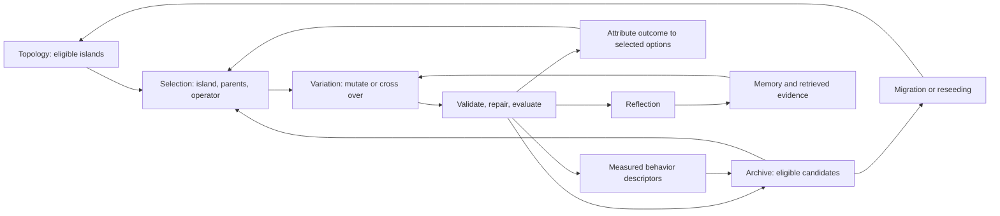

# RSIKit: concepts first, agents as compositions

Revised 2026-09-16 in response to the user's taxonomy correction. This supersedes
the architectural grouping and next-build priorities of the
[earlier agent survey](rsikit-improvement-modules-comparison.md), while retaining
its agent-by-agent evidence. The first API-only implementation remains useful,
but does not yet provide this full set of independently reusable concepts.

**Implementation follow-up:** the [concept module plan](../docs/superpowers/plans/2026-09-16-rsikit-concepts.md)
now delivers direct samplers, UCB1, Beta-Bernoulli Thompson sampling, explicit
crossover/lineage, elite/stepping-stone/QD archives, feature grids and snapshot
migration. The [usage guide](../README.md) and
[two offline compositions](../rsikit/examples/concepts.py) show their current contracts.
The broader families below still include variants beyond this first implementation.

Scope: pretrained models called through APIs. Editable prompts, examples, guidance,
candidate artifacts and host-side search state. Updating a sampler's counts or
posterior is ordinary search bookkeeping; it does not update the LLM's weights.
There is no training module in this design.

## 1. The corrected module families

The organizing unit is a reusable decision or state structure. Named agents are
recipes combining them. These are conceptual families, not ten required classes,
directories or interfaces. Pure decisions should remain ordinary functions.

| Family | Responsibility | Concepts grouped here |
|---|---|---|
| **Variation** | Produce a new candidate from existing material | Initialization, mutation, crossover/recombination, component editing, simplification, differential-style variation, guided variation |
| **Selection and allocation** | Choose what gets the next use of a limited resource | Uniform, weighted/rank, tournament, softmax, epsilon-greedy, UCB variants, Thompson sampling, tree selection, evaluation racing; reward attribution for adaptive policies |
| **Populations, archives and survival** | Store candidates and decide which remain eligible | Incumbent, elite population, all-valid archive, niche archive, Pareto archive, specialist portfolio; insertion, replacement, retirement and eviction |
| **Diversity and quality diversity** | Define meaningful differences and preserve useful coverage | Behavior descriptors, cells/niches, novelty/distance, duplicate detection, niche competition, coverage and QD metrics |
| **Islands and topology** | Partition search and control exchange between populations | Island-local state, migration graph, migrant selection, migration timing, reseeding/reset and new-island creation |
| **Feedback and reflection** | Convert observed outcomes into proposed lessons | Failure diagnosis, pairwise reflection, batch critique, tool-grounded feedback, repair guidance |
| **Memory and context** | Retain experience and decide what enters the next prompt | Recent history, exemplars, negative examples, bounded reflections, consolidation, retrieval, context ordering and scope |
| **Evaluation and evidence** | Measure candidate behavior under a fixed contract | Validity, scalar/vector objectives, per-case outcomes, descriptors, repeated trials, noise, cost and provenance |
| **Execution and lifecycle** | Decide when work runs and when its effects become visible | Generational snapshots, steady-state updates, async completion, repair limits, caching, deadlines and shared budgets |
| **Meta-optimization** | Improve the text that controls future improvement | Instruction search, mutation-prompt evolution, component-level prompt search; downstream evaluation and independent selection gates |

Shared foundation: artifact identity, complete parent lineage, editable boundaries,
operation identity and evaluator version. A prompt instruction, generated program
and reflection are different artifact roles, even though all can be represented
as text. Multi-parent variation needs all contributing parent IDs; a single
`parent_id` only identifies the primary parent.

The split is an architectural synthesis. Specific mechanisms and differences
below are grounded in inspected local code or the linked primary literature.

## 2. Mutation and crossover are first-class variation concepts

| Operator concept | Inputs and intent | Local donors / qualification |
|---|---|---|
| Initialization | Task and optional exemplars → a starting candidate | EoH initialization; no evolutionary parent is required conceptually, even if a seeded recipe supplies one |
| Mutation | One parent → an altered child | EoH M1 structural edits, M2 tuning and M3 simplification are mutation subtypes |
| Crossover / recombination | Two or more parents → a child combining selected traits | AEL, LLM-GP, EvoPrompt and ReEvo; not restricted to copying literal text spans |
| Multi-parent exploration | Several parents → a new direction informed by their similarities or differences | EoH E1/E2; preserve their distinct intents rather than calling every multi-parent prompt identical crossover |
| Differential-style variation | Donor differences and a reference candidate → proposed change, then recombination with a target | EvoPrompt's textual DE; this uses prose transformations, not vector arithmetic on LLM weights |
| Component variation | Parent system(s) and named editable component → changed component(s) | GEPA and InstOptima; preserve components outside the chosen edit scope |
| Guided variation | Any compatible operator plus attributed feedback → a child | ReEvo guidance can condition crossover or mutation; reflection is not itself a crossover operator |

Sources: [EoH](https://github.com/StuartFarmer/slick-bits/blob/355335f290ddb1ea9b08dbd41aeccc6136779a69/eoh/agent.py), [AEL](https://github.com/StuartFarmer/slick-bits/blob/355335f290ddb1ea9b08dbd41aeccc6136779a69/ael/agent.py),
[LLM-GP](https://github.com/StuartFarmer/slick-bits/blob/355335f290ddb1ea9b08dbd41aeccc6136779a69/llm_gp/agent.py), [EvoPrompt](https://github.com/StuartFarmer/slick-bits/blob/355335f290ddb1ea9b08dbd41aeccc6136779a69/evoprompt/agent.py),
[ReEvo](https://github.com/StuartFarmer/slick-bits/blob/355335f290ddb1ea9b08dbd41aeccc6136779a69/reevo/agent.py), [GEPA](https://github.com/StuartFarmer/slick-bits/blob/355335f290ddb1ea9b08dbd41aeccc6136779a69/gepa/agent.py),
[InstOptima](https://github.com/StuartFarmer/slick-bits/blob/355335f290ddb1ea9b08dbd41aeccc6136779a69/instoptima/agent.py).

Separate **operator intent** from **proposal mechanism**. A crossover can be an
LLM prompt or a deterministic merge of compatible components. The operation's
parent requirements, changed artifact, invariants and lineage remain explicit.
Selecting which operator to use belongs to selection; carrying it out belongs to
variation. Repair is a constrained revision whose stopping criterion is validity.

Current RSIKit exposes EoH-style operations through `PromptProposer`, but the
names `E1`, `E2`, `M1` etc. should become recipe aliases for documented concepts,
not the only way users discover the operator library. New LLM operations should
retain separate Slick methods/templates and dispatch in Python.

## 3. One selection family, several kinds of policy

Yes: UCB and Thompson sampling belong together here. So do parent sampling,
operator selection and island allocation. Their shared question is which eligible
option to choose next. Their input evidence and state requirements differ.

| Subfamily | Policies | Evidence/state required | Appropriate use |
|---|---|---|---|
| Direct selection | Best, uniform, tournament, rank, roulette/weighted, softmax | Eligible options, current comparison values, RNG where relevant | Parents, inspirations, operators or islands when an existing score/weight suffices |
| Explicit exploration | Epsilon-greedy, temperature-controlled sampling, fixed mixtures | Current values plus exploration settings | Mix exploitation with deliberate exploration |
| Optimism under uncertainty | UCB1-style bounds; discounted/windowed variants; local UCB-E variants | Arm-specific observations, counts, reward estimates and a defined exploration rule | Allocate calls toward promising but insufficiently explored options |
| Posterior sampling | Thompson sampling; posterior variants suited to the reward | Prior and observation model; posterior updates from measured rewards | Sample plausible arm values and choose the best sampled option |
| Tree-aware selection | UCT and related tree policies | Parent/child visits, backed-up rewards, eligible branches | Select a branch within an explicit tree; a flat archive does not supply tree semantics |
| Evaluation racing | Successive halving, successive rejects, uniform evaluation allocation | A candidate cohort, repeated measurements and an evaluation allowance | Spend evaluation effort to identify survivors; distinct from selecting generation parents |

UCB's confidence bonus and Thompson sampling's posterior draws are alternative
ways to handle exploration. Thompson sampling needs a reward model: a Beta-Bernoulli
version fits binary outcomes, not arbitrary continuous fitness without a declared
transformation. Discounted/windowed variants address changing observations, but
do not inherit stationary-bandit guarantees automatically. See
[Auer et al., UCB analysis](https://people.eecs.berkeley.edu/~russell/classes/cs294/s11/readings/Auer%2Bal%3A2002.pdf)
and [Russo et al., Thompson sampling tutorial](https://arxiv.org/abs/1707.02038).

This is a conceptual grouping, not a universal `select()` method that silently
fabricates missing statistics. Static selectors can be functions; adaptive
selectors need a choice step and an explicit observation/update step. Racing
also owns evaluation rounds. Keep separate state for each selection role.

### The same policy can act at several levels

| Selection role | Options / arms | Example evidence and reward |
|---|---|---|
| Choose parents | Candidate IDs | Measured quality, rank, lineage counts; or descendant reward if explicitly learning parent productivity |
| Choose variation | Operator IDs such as mutation and crossover | Improvement produced by each selected operator |
| Choose island | Island IDs | Improvement produced by work allocated to that island |
| Choose niche/cluster | Cell or cluster IDs | Offspring quality, archive gain or new coverage, as specified by the recipe |
| Choose API configuration | Fixed provider/model/configuration IDs | Downstream measured gain, optionally adjusted for measured cost |
| Choose what to evaluate | Candidate or candidate/case IDs | Repeated observed performance and uncertainty |

Do not mix these rewards into one history. An island, operator and model can all
participate in one attempt, but crediting each is a stated policy decision, not
evidence of independent causal contribution.

### What the local agents actually do

| Local source | Selection mechanism and option identity | Caveat / confidence |
|---|---|---|
| [RSIKit EoH/DGM](../rsikit/selection.py) | Rank-weighted parents; sigmoid quality divided by one plus admitted child count | Inspected implementation; neither is an uncertainty-estimating bandit |
| [AdaEvolve](https://github.com/StuartFarmer/slick-bits/blob/355335f290ddb1ea9b08dbd41aeccc6136779a69/adaevolve/agent.py) | UCB-style argmax over islands, with decayed improvement reward; distinct exploration-intensity rule | Inspected; reward uses decayed counts while bonus uses raw visits; migrants do not receive UCB credit |
| [QUBE](https://github.com/StuartFarmer/slick-bits/blob/355335f290ddb1ea9b08dbd41aeccc6136779a69/qube/agent.py) | Confidence ranking over behavioral clusters, then length-biased softmax sampling within selected clusters | Inspected; island choice is uniform; quality becomes observed offspring mean, not just parent quality; fallback uses a seed score |
| [ShinkaEvolve](https://github.com/StuartFarmer/slick-bits/blob/355335f290ddb1ea9b08dbd41aeccc6136779a69/shinkaevolve/agent.py) | UCB-like weights over model/provider options, sampled proportionally; positive gains transformed on a pooled scale | Inspected local adaptation; proportional choice is not classic argmax UCB1 |
| [ProTeGi](https://github.com/StuartFarmer/slick-bits/blob/355335f290ddb1ea9b08dbd41aeccc6136779a69/protegi/agent.py) | UCB/UCB-E allocate evaluation examples among prompt candidates; also successive rejects/halving | Inspected; uncertainty concerns estimated prompt quality, not mutation productivity |
| [LATS](https://github.com/StuartFarmer/slick-bits/blob/355335f290ddb1ea9b08dbd41aeccc6136779a69/lats/agent.py) | UCT selects tree branches using visits and backed-up reward | Inspected tree donor; requires tree lifecycle, not only a UCB formula |
| [RSIKit Thompson sampling](../rsikit/selection.py) | New Beta-Bernoulli implementation in the selection family | No named implementation was found in the original local `agent.py` scan; added from the primary method, not attributed to those donors |

An observation should retain the selected option, selection role, attempt ID,
outcome, reference baseline, reward definition and resource usage. For example,
operator reward could be `max(child_utility - parent_utility, 0)`, while a QD
recipe may use archive improvement. Neither definition should be built into every
sampler. Invalid candidates, provider failures and cancelled attempts need separate
recorded statuses; the recipe decides whether each receives zero reward or no
reward update. Samplers must not silently conflate them.

## 4. Islands, archives and quality diversity are independent axes

**An island is a search partition.** It owns a local population/archive and any
local policy or memory state. A topology specifies which islands can exchange
candidates. Migration determines what moves, where, when and how arrivals are
admitted. Reset/reseeding replaces a search population; it is not the same as
migrating a few candidates. Island selection is delegated to a sampler.
[Local AlphaEvolve](https://github.com/StuartFarmer/slick-bits/blob/355335f290ddb1ea9b08dbd41aeccc6136779a69/alphaevolve/agent.py), [AdaEvolve](https://github.com/StuartFarmer/slick-bits/blob/355335f290ddb1ea9b08dbd41aeccc6136779a69/adaevolve/agent.py)
and [ShinkaEvolve](https://github.com/StuartFarmer/slick-bits/blob/355335f290ddb1ea9b08dbd41aeccc6136779a69/shinkaevolve/agent.py) demonstrate different exchange policies.

**An archive is a retained set with an admission rule.** It can keep elites,
all valid stepping stones, niche champions, non-dominated tradeoffs or complementary
specialists. A global best can be tracked independently. Selecting a candidate
for reproduction does not imply it survives the next archive update.
[DGM archive](../rsikit/population.py), [MEOH](https://github.com/StuartFarmer/slick-bits/blob/355335f290ddb1ea9b08dbd41aeccc6136779a69/meoh/agent.py),
[EoH-S](https://github.com/StuartFarmer/slick-bits/blob/355335f290ddb1ea9b08dbd41aeccc6136779a69/eoh_s/agent.py).

**Quality diversity combines measured quality with behavioral coverage.** In a
MAP-Elites-style recipe, descriptors locate a candidate in a niche and its quality
competes with the incumbent of that niche. A useful new niche may contain a
candidate worse than the global best. Requested features in a generation prompt
do not establish its measured niche.
[MAP-Elites paper](https://arxiv.org/abs/1504.04909),
[In-context QD implementation](https://github.com/StuartFarmer/slick-bits/blob/355335f290ddb1ea9b08dbd41aeccc6136779a69/in_context_qd/agent.py).

| Diversity concept | What must stay distinct |
|---|---|
| Behavior descriptor | Measured properties used to distinguish outcomes; not necessarily quantities to maximize |
| Quality / fitness | Objective(s) used to compare performance |
| Novelty | Difference from a defined reference set under a declared distance |
| QD archive | Admission based on both niche and quality |
| Pareto archive | Objective tradeoffs; not interchangeable with a behavior grid |
| Specialist portfolio | Complementary case performance; an average can hide this information |
| Duplicate filter | Exact/semantic redundancy criterion; deduplication alone does not implement QD |

Consequently, all four compositions are meaningful: one population with elites,
one QD archive, several islands with elite populations, or several islands each
containing a QD archive. A UCB sampler can allocate effort among those islands
without changing how a candidate is assigned to a niche.

## 5. Composition rather than agent-shaped modules

The recipe determines the update boundary: immediate, per operator batch,
generation snapshot or asynchronous completion. The diagram is a decomposition,
not a mandate to execute every stage on every attempt.

| Recipe | Composition |
|---|---|
| EoH-style search | Rank parent selection + fixed portfolio of mutation/multi-parent operators + generation snapshot + elite survival |
| ReEvo-style search | Measured pair reflection + guided crossover + consolidated guidance + elite mutation |
| DGM-style artifact archive | Quality/lineage parent selection + diagnosis/revision + all-valid stepping stones; does not imply executable agent self-modification |
| In-context QD | Measured descriptors + niche elites + target/context sampling + feature-conditioned generation |
| Adaptive island search | Islands + island sampler + local archive/sampler + variation + attributed reward + migration/reset policy |
| Adaptive operator portfolio | Mutation/crossover operators as arms + UCB or Thompson sampling + measured child reward + separately chosen survival policy; proposed composition |

The important test of reuse is whether rank can be replaced by tournament selection,
or island allocation by Thompson sampling, without rewriting mutation prompts,
descriptor calculation or archive admission.

## 6. What exists and what is still missing in RSIKit

| Concept | Present implementation | Missing reusable boundary |
|---|---|---|
| Variation | `PromptProposer` has mutation, explicit crossover, legacy EoH operations and multi-parent lineage | Further component/differential operator variants |
| Selection | Direct samplers, UCB1 and binary Thompson policies, attributed observations and existing survival helpers | Discounted/windowed variants, continuous-reward posteriors and explicit racing recipes |
| Archives/survival | Independent elite, all-valid and QD archives with measured admission | Pareto and specialist portfolio policies; legacy recipe extraction remains incremental |
| Islands | Independent archive populations plus snapshot migration over directed routes; adaptive allocation in the example | Generalized reseeding/spawning policies remain inside donor recipes |
| QD | `FeatureGrid`, measured-cell `QDArchive`, coverage and example quality measurements | Richer descriptors/novelty and alternative niche structures |
| Reflection/memory | `ReflectionMemory`, recent context and recorded evidence | Broader consolidation/retrieval and scope policies when a recipe needs them |
| Evaluation | Validity, named finite metrics and task feedback | Explicit per-case vectors, descriptors and repeated-observation metadata where required |
| Meta-optimization | `PromptSearch` compares instruction revisions with independent selection evidence | Reuse variation/sampling/archive concepts inside text-level meta-search |

Relevant current code: [proposer](../rsikit/proposer.py),
[selection](../rsikit/selection.py), [strategies](../rsikit/population.py),
[reflection](../rsikit/reflection.py), [prompt search](../rsikit/prompt_search.py).
This is a gap assessment, not a claim that all proposed samplers or modules already exist.

## 7. Corrected next-build order

1. **Selection plus credit records.** Start with direct samplers, one explicitly
   specified UCB policy and a Thompson policy with a declared reward model. Reuse
   them for two roles, such as operator and island selection, with separate state.
2. **Variation vocabulary.** Make mutation and crossover discoverable concepts;
   preserve EoH intent, parent cardinality and full lineage. Reuse existing prompts.
3. **Archive and QD composition.** Extract current elite/all-valid/niche decisions;
   add descriptors and coverage measurements. Check that a lower global score can
   enter an empty niche and that a worse candidate cannot replace its niche elite.
4. **Islands and migration.** Compose islands from those archives, then plug in an
   island sampler. Keep migration/reset policy explicit and preserve donor recipes.
5. **Compose two contrasting recipes.** A standard mutation/crossover population
   and adaptive QD islands establish reuse. Reflection and prompt search can attach
   to both through their existing evidence/context boundaries.

These priorities replace treating islands, QD and adaptive selection as distant
extras. Keep existing agent recipes as compatibility examples. Introduce only the
state and evidence each selected policy actually needs; no universal agent runtime
or inheritance hierarchy is required.

## Sources and verification

The original [45-agent comparison](rsikit-improvement-modules-comparison.md) remains
the source inventory. This revision checked current local selection, variation,
island and QD code; links above identify the implementations. Local behavior has
high confidence from source inspection; it is not a fresh claim of paper fidelity
or reproduced benchmark results. ShinkaEvolve and ProTeGi provide additional local
selection examples beyond that earlier inventory. Thompson sampling was proposed
in this revision and subsequently implemented separately in RSIKit. The taxonomy
pass changed documentation only; the linked follow-up implementation used offline
scripted checks and made no live model calls or training runs.

Primary references newly checked:

- [Auer, Cesa-Bianchi and Fischer: Finite-time Analysis of the Multiarmed Bandit Problem](https://people.eecs.berkeley.edu/~russell/classes/cs294/s11/readings/Auer%2Bal%3A2002.pdf).
- [Russo et al.: A Tutorial on Thompson Sampling](https://arxiv.org/abs/1707.02038).
- [Mouret and Clune: Illuminating Search Spaces by Mapping Elites](https://arxiv.org/abs/1504.04909).
