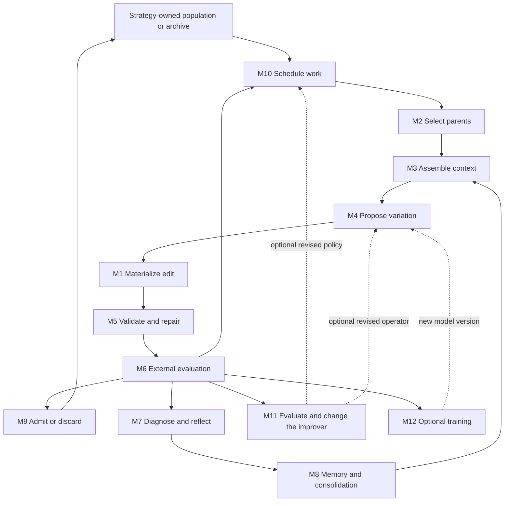

# Auto-improving agents as reusable RSIKit building blocks

**Architecture revision:** the [concept-first module comparison](rsikit-conceptual-modules-comparison.md)
supersedes the grouping and next-build priorities below. It makes variation,
selection/samplers, islands, archives and quality diversity explicit reusable
families. This document remains the detailed agent evidence inventory; its training
comparisons are outside the user's API-only scope.

Investigation date: 2026-09-16. Scope: the local evolutionary/code-improvement agents, relevant reflection and memory methods, and selected adjacent methods that contribute a distinct reusable mechanism. This is a mechanism comparison, not a performance ranking or a claim to reproduce the papers.

Implementation scope subsequently narrowed by the user: **fixed pretrained API models only; no weight updates or fine-tuning**. The [API-only implementation plan](../docs/superpowers/plans/2026-09-16-rsikit-api-improvement.md) removes M12 and focuses on editable instructions, context, reflection and downstream-tested prompt changes. Training methods below remain research comparisons, not planned features.

## Recommendation

Keep RSIKit's existing `generate()` / `update()` boundary. Decompose the decisions inside each strategy into **selection, context, variation, validation/repair, evaluation, reflection, memory, admission, scheduling, meta-improvement, and optional training**, with an explicit artifact/edit contract underneath them. These are **12 conceptual modules**, not a proposal for 12 new classes or files. Start with ordinary functions and the existing strategy-owned state.

The strongest extraction candidates are EoH's operation-aware proposals, ReEvo's comparative reflection, DGM's stepping-stone admission, and AlphaEvolve's diversity-preserving archive. RSIKit already implements much of three of these; the immediate opportunity is to make their decisions reusable and add reflection without replacing the working experiment loop. [Current strategies](../rsikit/strategies.py), [population policies](../rsikit/population.py), [existing operation dispatch](../rsikit/examples/circle_packing/experiment.py).

The module boundaries and implementation order below are this investigation's synthesis. Statements about a named local method are grounded in its linked implementation; external links establish the original method's intent, with deviations called out.

## 1. First distinguish what improves

| Improvement target | What changes between attempts | Representative methods | What success would establish |
|---|---|---|---|
| An artifact | Program, heuristic, prompt, reward function, persona or complete answer | EoH, AlphaEvolve, Eureka, PersonaEvolve | A better measured artifact under the chosen evaluator |
| Guidance and experience | Reflections, examples, failure records, reusable insights | ReEvo, Reflexion, ExpeL | Later attempts benefit from retained experience |
| Search controls | Island allocation, mutation intensity, operator choice, parent selection | AdaEvolve, QUBE | Better use of a fixed search budget |
| The improver itself | Mutation instructions, executable strategy, agent code, optimizer code | Promptbreeder, EvoX, DGM, STOP | The modified improver performs better on downstream work |
| Model parameters | Soft prompts or model weights | EvoPrompting, STaR | A trained model/version changes future generation |

These targets can coexist. A generated critique does not prove improvement; an archive of code does not imply self-modification; adaptive scheduling does not imply that scheduler code evolves. In particular, RSIKit's `DGMArchive` implements archive search, while the sibling DGM implementation executes an evolving parent agent as its modifier. [RSIKit scope](../rsikit/README.md), [DGM execution](../dgm/agent.py).

## 2. The conceptual modules

Read the contracts as data flow, not proposed API signatures. State stays with the strategy or application that owns it. A module may be a pure function, a callback, a small stateful helper, or several explicit recipe steps.

| ID / module | Question answered | Inputs → outputs | State it needs | Distinct mechanisms to preserve |
|---|---|---|---|---|
| **M1 Artifact and edit contract** | What is being changed, and which changes are legal? | Parent artifact + proposed replacement/patch → materialized candidate or rejection | IDs, ancestry, source/version, optional thought or component descriptions | Whole-source replacement; protected regions; reversible patches; idea+code; composite prompt systems; executable strategy/agent. EoH, LLM-GI, GEPA, DGM |
| **M2 Parent and seed selection** | Which existing candidates should generate the next proposal? | Eligible archive/population + scores + RNG → parents/inspirations | Optional child counts, rank data or tree visit statistics | Best-only; rank sampling; tournament; quality/child-count weighting; behavioral niche sampling; UCT. DGM, EoH, QUBE, LATS |
| **M3 Context assembly and retrieval** | Which evidence should the proposer see? | Task + selected parents + history/memory + context allowance → proposal context | Retrieval corpus/index if needed; selection provenance | Recent outcomes; score-sorted demonstrations; diverse inspirations; successful similar tasks; per-case failures. OPRO, AlphaEvolve, ExpeL, GEPA |
| **M4 Variation operators** | How should a candidate change? | Operation + parents + context → candidate draft and optional explanation | Usually none; optionally evolving mutation instructions | Mutation, crossover, differential-style rewriting, conceptual exploration, parameter tuning, simplification, component merge. EoH, EvoPrompt, LLM-GA, GEPA |
| **M5 Validation and repair** | Is the proposal admissible to measurement? | Draft + fixed checks + diagnostics + repair allowance → valid draft or recorded rejection | Bounded repair trace | Edit-scope preservation, parse/interface checks, feedback-directed repair, original fallback where explicitly part of the method. Existing RSIKit repair, LMCA, LLM-GI |
| **M6 Evaluation and evidence** | What happened when the candidate was tried? | Candidate + task/case/environment + evaluator version → validity, measurements and observations | Case results, repetitions, stage outcomes; application-owned execution | Scalar/vector fitness; constraints; descriptors; candidate×case matrices; pairwise payoffs; staged evaluation. EoH-S, MEOH, CCMO, PSRO, AlphaEvolve |
| **M7 Diagnosis and reflection** | What change does the evidence suggest? | One failure, a better/worse pair, or a batch of outcomes → attributed critique or improvement guidance | Optional temporary working context | Self-critique; tool-grounded critique; pairwise comparison; reward-component analysis; task failure diagnosis. SELF-REFINE, CRITIC, ReEvo, Eureka, DGM |
| **M8 Memory and consolidation** | Which experience should influence future attempts? | New outcomes/reflections + prior memory → revised memory | Bounded episodes, long-term insights, rejection lists, successful exemplars | Sliding retry memory; short→long reflection; insight voting; operator-specific negative memory. Reflexion, ReEvo, ExpeL, LLM-GA |
| **M9 Admission and survival** | Which evaluated candidates remain available? | Evaluated offspring + current store + objective/descriptor rules → retained set and admission event | Incumbent, population, cells, Pareto set or open archive | Strict hill climbing; fixed-size elites; all functional stepping stones; niche champions; Pareto survival; complementary portfolio selection. DGM, EoH, In-context QD, MEOH, EoH-S |
| **M10 Scheduling and credit assignment** | Where does the next unit of search effort go, and when do updates become visible? | Search state + budget + recent outcomes → operation/island/batch/model choice | Operator cycles, island statistics, reward windows, pending work | Frozen generations; per-operator replacement; completion-driven updates; adaptive exploration; offspring-quality credit; racing; migration/reseeding. EoH, LLM-GA, AlphaEvolve, AdaEvolve, QUBE, EPO |
| **M11 Meta-improvement and nested execution** | Can the mechanism producing candidates be changed and evaluated? | Improver artifact + downstream tasks + nested budget → revised improver and downstream evidence | Separate improver versions, strategy archive, attribution across inner runs | Evolving mutation prose; executable selection/operator strategies; agent self-modification; recursive improver optimization. Promptbreeder, EvoX, DGM, STOP |
| **M12 Training and model update** | Does experience change the generator's parameters? | Accepted examples + base model/version + training recipe → trained model/soft-prompt version | Training corpus, checkpoints, model identity and costs | EvoPrompting's tuning callback; STaR's correctness-filtered rationale training. Keep separate from text memory and in-context examples |

### How they fit together



This diagram is a synthesis of the inspected flows, not one mandatory execution order. ReEvo reflects before crossover; CRITIC obtains tool evidence inside its critique; repair may execute a candidate before final scoring; nested DGM/STOP runs contain their own inner loops. A recipe determines ordering and visibility.

### Module boundaries that matter

**Selection and admission are independent.** DGM's parent weighting answers where to search next; retaining every functional child answers which stepping stones remain searchable. One can change without the other. The same distinction lets a high-scoring global incumbent coexist with a diverse archive of weaker candidates. [DGM policy](../dgm/agent.py), [RSIKit archive implementation](../rsikit/population.py).

**Reflection, memory and retrieval are separate.** Reflection generates a hypothesis from evidence. Memory decides whether to keep or consolidate it. Retrieval decides when to expose it. ReEvo's accumulated guidance, Reflexion's retry memory, and ExpeL's transferable insights differ along these axes. An embedding store implements retrieval; it does not validate an insight. [ReEvo](../reevo/agent.py), [Reflexion](../reflexion/agent.py), [ExpeL](../expel/agent.py).

**Diversity is not one score.** Behavioral cells preserve coverage; Pareto fronts preserve objective tradeoffs; per-case specialists preserve complementary competence; child-count penalties spread ancestry; strategy uncertainty encourages measurement. Keep descriptor computation separate from objective comparison and allocation policy. [In-context QD](../in_context_qd/agent.py), [MEOH](../meoh/agent.py), [EoH-S](../eoh_s/agent.py), [DGM](../dgm/agent.py), [QUBE](../qube/agent.py).

**Repair and improvement have different stopping conditions.** Repair stops when specified validity checks pass. Improvement requires a favorable measured outcome under the search policy. In the packing example, execution and geometry checks already produce reusable measurements during repair; the experiment reuses those results instead of executing the accepted source again. [Bounded repair](../rsikit/repair.py), [packing measurement flow](../rsikit/examples/circle_packing/experiment.py).

**Scheduling changes the algorithm.** Keeping generation-start parents fixed is different from allowing each successful child to become the next parent immediately. Preserve the original population snapshot and admission boundary when extracting EoH, LLM-GA and MEOH. A common `for iteration` loop alone does not preserve this behavior. [EoH](../eoh/agent.py), [LLM-GA](../llm_ga/agent.py), [MEOH](../meoh/agent.py).

## 3. Agent-by-agent differences and extraction map

The tables cover **45 local implementations**: 28 evolutionary, adaptive, recursive or diagnostic methods; 15 feedback/prompt/training donors; and PersonaEvolve plus LATS. The four existing RSIKit strategies are mapped separately in section 4. Methods without a measured improvement loop are explicitly marked. Ordinary reasoning ensembles and the rest of the prompt-optimization catalogue are outside the agreed scope.

**Evidence convention:** linked local code establishes the described behavior. Confidence in those inspected mechanics is high; correspondence to the original work is qualified where implementation or retrieval gaps exist. “Distinctive” means useful to distinguish these methods, not a priority claim about who invented a technique. Every row names its primary extraction targets; common plumbing such as M1/M6 is not repeated everywhere.

### 3.1 Basic variation, program improvement and population methods

| Agent / local evidence | Distinctive behavior and retained state | Extract into | Primary source and limits |
|---|---|---|---|
| [AEL](../ael/agent.py) | Idea+implementation; uniform distinct parents from a generation snapshot; probabilistic crossover then mutation; best N parents+children survive. A simple baseline for composing operators | M1, M2, M4, M9, M10 | [Paper](https://arxiv.org/abs/2311.15249). Local snapshot/uniform choices follow the paper rather than later weighted/immediate-release behavior |
| [EoH](../eoh/agent.py) | Five operators: E1 diverse idea, E2 extend shared idea, M1 structural modification, M2 parameter tuning, M3 simplification. Rank-sample parents, produce N attempts per operator against one snapshot, then select elites | M2, M4, M9, M10 | [Paper](https://arxiv.org/abs/2401.02051), [official repository](https://github.com/FeiLiu36/EoH). Fixed operator portfolio; no adaptive operator learner. Local full-generation replacement differs from pinned upstream per-operator replacement |
| [LLM-GA](../llm_ga/agent.py) | Four EoH-like operators; children must beat the operator batch's worst incumbent; population replacement after each operator. Rejections are fed back to the responsible operator | M4, M8, M9, M10 | [Official repository](https://github.com/liuyujiang123/LLM-GA). Domain-generalized port; local blacklist is prompt context, not a hard exclusion filter. Original feedback-path fidelity remains qualified |
| [LLM-GP](../llm_gp/agent.py) | Mu/XO uses tournament selection, model crossover/mutation and retained elite. Full variant delegates parent/survivor/final-ID choice to the model while fitness remains measured. Keeps measured and model-designated best separate | M2, M3, M4, M9 | [Paper](https://arxiv.org/abs/2401.07102), [official tutorial](https://github.com/ALFA-group/Tutorial_GP-LLM). Tutorial supports Mu/XO; full variant also uses paper descriptions. Validate model-selected IDs |
| [LMEA / LLMEvolution](../llm_evolution/agent.py) | Model chooses two parents and crossover/mutation operators using supplied knowledge; host retains best unique candidates. Generation snapshot and operator lineage survive | M2, M4, M9 | [Paper](https://arxiv.org/abs/2310.19046), [official source](https://github.com/cschen1205/LMEA/blob/main/src/models/llm_tsp.py). Local separates parent/crossover/mutation calls; host survival distinguishes it from full LLM-GP |
| [LLM-GI 2023](../llm_gi/agent.py) | Select a replaceable code fragment; ask for variations and use the first valid parsed suggestion. Correctness-gated runtime/cost search: strict best-first local mutation or independent mutation of the original | M1, M4, M5, M9 | [Official artifact](https://doi.org/10.5281/zenodo.8304433), [Gin source](https://github.com/gintool/gin/blob/9fe9bdf3ad6115fa26bebbe258f31b4507bac884/src/main/java/gin/edit/llm/LLMReplaceStatement.java). Local generic fragments replace JavaParser; pinned upstream could not be fetched in this pass |
| [LLM-GI 2025](../llm_gi_2025/agent.py) | Independent search per hot method; stable block IDs and ordered patches. Add an LLM edit or remove one by replaying the remaining patch from original source; accept strict passing improvements | M1, M4, M5, M9 | [Journal artifact](https://doi.org/10.5281/zenodo.13381774), [pinned Gin](https://github.com/gintool/gin/tree/f2f6e1018229cf2d8d3220bf1482635af5657806). Reversible patch neighborhoods are the key reusable difference; fresh upstream source audit unavailable |
| [ReEvo](../reevo/agent.py) | Compare unequal-fitness pairs; reflect on worse→better differences; guide crossover. Compress insights into long-term guidance and mutate the elite. Working offspring population and all-time elite are distinct | M7, M8, M4, M9 | [Paper](https://arxiv.org/abs/2402.01145), [official code](https://github.com/ai4co/reevo). Learning occurs in text guidance, not weights; local black-box filtering and memory bounds are explicit choices |
| [Alpha-GPT](../alpha_gpt/agent.py) | Retrieve knowledge, polish hypothesis, generate and repair seeds, run domain crossover/mutation, review results into a new research direction; optional human feedback | M3, M4, M7, M10 | [Paper](https://arxiv.org/html/2308.00016v2), [publication](https://aclanthology.org/2025.emnlp-demos.14/). Architecture-level correspondence; exact search policies are local. Variation callbacks need not be LLM calls |
| [Optimizing the Optimizer](../optimizing_the_optimizer/agent.py) | Feedback dialogue revises optimizer heuristics; separate performance-only branch. Active revision may pass through regressions while historical best remains available | M4, M7, M8, M9 | [Paper](https://annals-csis.org/Volume_43/drp/pdf/1481.pdf), [official repository](https://github.com/camilochs/optimizing-the-optimizer). Autonomous bounded dialogue is a local adaptation. Its separate CMSA solver is domain-specific and has a [GPL-2.0-or-later source notice](../optimizing_the_optimizer/cmsa.py); do not assume repository-level MIT metadata covers copying that helper |
| [LMCA](../lmca/agent.py) | Neutral mutation chain accepts every valid result, including self-loops; repair and fallback model; analyze recurrence, structure and edit distance | M5; diagnostics around M4 | [Official repository](https://github.com/can-gurkan/lmca). **Diagnostic donor, not a fitness optimizer.** Structural recurrence is not semantic equality or proof of permanent convergence |

### 3.2 Diversity, adaptation and recursive improvement

| Agent / local evidence | Distinctive behavior and retained state | Extract into | Primary source and limits |
|---|---|---|---|
| [AlphaEvolve](../alphaevolve/agent.py) | Islands with behavior-cell/objective champions; parent/inspiration/model/prompt sampling; protected edits; evaluation cascade; immediate asynchronous registration, resets and optional guidance evolution | M2–M6, M9–M11 | [Paper](https://arxiv.org/html/2506.13131v1), [official results repository](https://github.com/google-deepmind/alphaevolve_results). Exact local policies are adaptations; released results do not expose original agent internals. Local archive is not a Pareto frontier |
| [AdaEvolve](../adaevolve/agent.py) | Decayed-reward UCB allocates islands; normalized improvement history changes exploration intensity; separate exploration/exploitation context; migration, stagnation responses and bounded tactic guidance | M2, M3, M8, M10 | [Paper](https://arxiv.org/html/2602.20133v1), [official adaptation code](https://github.com/skydiscover-ai/skydiscover/blob/0d932b690670a7e544388ad362e9876c8bd256a0/skydiscover/optimize/search/adaevolve/adaptation.py). Adapts fixed control rules and prose; does not evolve scheduler source. Local diversity uses lexical distance |
| [In-context QD](../in_context_qd/agent.py) | Keep best per behavioral cell; choose target niches, prefer empty ones; prompt with ordered archive examples plus desired fitness/features; admit into the **measured** cell | M2, M3, M4, M6, M9 | [Paper](https://arxiv.org/html/2404.15794v1). Desired-behavior conditioning is additional to the archive. Paper-based local implementation; task must supply meaningful descriptors |
| [QUBE](../qube/agent.py) | Exact behavior-signature clusters; prioritize mean offspring quality plus uncertainty; length-biased representative selection; credit parent clusters and reset weak islands | M2, M6, M9, M10 | [Primary manuscript](https://openreview.net/pdf?id=y8Ctbiriia), [indexed manuscript](https://openreview.net/pdf/0a690b7b53274608454fe2f9b6945555d56544c6.pdf). Cluster productivity differs from parent fitness. High local confidence; exact primary formula verification is medium because full-text access hit browser verification |
| [DGM](../dgm/agent.py) | Quality/child-count archive selection; fixed-model diagnosis; selected executable parent implements modification; downstream evaluation plus self-modification capability check; retain every functional child | M2, M5, M7, M9, M11 | [Paper](https://arxiv.org/abs/2505.22954), [official outer loop](https://github.com/jennyzzt/dgm/blob/a565fd2d1dca504ef5104a7cc0f3bdc4ab9b4fd2/DGM_outer.py). Single-module local adapter replaces upstream repository/tool machinery. A child may be useful even if its immediate score regresses |
| [EvoX](../evox/agent.py) | Executable strategy chooses parents, inspirations and operations; performance windows credit strategies; stagnation triggers state-conditioned strategy mutation; validate/deploy now, measure on later windows | M2, M4, M10, M11 | [Paper](https://arxiv.org/html/2602.23413v1), [official scorer](https://github.com/skydiscover-ai/skydiscover/blob/0d932b690670a7e544388ad362e9876c8bd256a0/skydiscover/optimize/search/evox/utils/search_scorer.py). Local windows, descriptors and selector interface are adaptations. Valid executable policy is not yet a demonstrated improvement |
| [STOP](../stop_optimizer/agent.py) | Optimizer code improves itself; evaluate it by running downstream optimization; separate target source, active modifier and rollback version; nested capabilities have separate budgets | M6, M10, M11 | [Paper](https://arxiv.org/abs/2310.02304), [official driver](https://raw.githubusercontent.com/microsoft/stop/main/run_improver.py). Local nonzero meta-utility acceptance does not compare against incumbent utility; recursive improvement is not guaranteed monotonic |
| [Zero-shot selection](../zero_shot_selection/agent.py) | Independently synthesize selector source; validate full batch before benchmarking; no measured outcome enters later synthesis; return operators and measurements | M2, M5; seed for M11 | [Paper](https://arxiv.org/html/2607.23505v1), [supplement](https://github.com/hengzhe-zhang/ppsn2026-zero-shot-llm-selection). **Operator-synthesis donor, not iterative self-improvement.** Bundled numerical selectors are interpreted from pseudocode |

### 3.3 Different objectives, training-mediated evaluation and coevolution

| Agent / local evidence | Distinctive behavior and retained state | Extract into | Primary source and limits |
|---|---|---|---|
| [EoH-S](../eoh_s/agent.py) | Evolve a complementary heuristic portfolio. Farthest pair in case-cost space or local refinement; greedily retain a set that improves per-case minima | M2, M6, M9 | [Official repository](https://github.com/FeiLiu36/EoH-S). Portfolio objective is mean of case-wise best costs. No learned dispatcher; accessing best member per case assumes evaluation of members. Not ordinary scalar elitism |
| [MEOH](../meoh/agent.py) | Objective directions + Pareto archive; dominance-masked AST similarity guides parent sampling and truncation; valid offspring join the live parent pool immediately | M2, M6, M9, M10 | [Paper](https://arxiv.org/html/2409.16867v2). Similarity is not generic crowding distance; substituting text similarity changes behavior. Local EoH-like operator schedule is adapted |
| [LLM4MOEA](../llm4moea/agent.py) | MOEA/D objective decomposition and neighborhoods over numeric vectors; LLM variation or fixed distilled linear variation; local replacement and Pareto archive | M1, M2, M4, M6, M9 | [Paper](https://arxiv.org/abs/2310.12541), [official code](https://github.com/FeiLiu36/LLM4MOEA). Numeric-vector adapter required. Local linear coefficients are fixed, not learned online |
| [CCMO-LLM](../ccmo_llm/agent.py) | Constrained and constraint-ignoring populations share GA/LLM offspring; strength/density survival; retain informative infeasible vectors | M4, M6, M9, M10 | [Paper](https://arxiv.org/abs/2405.05767), [backbone](https://github.com/BIMK/PlatEMO). Measurable constraint violation differs from invalid execution. In-context prompting is not weight fine-tuning; no verified author-specific implementation in local provenance |
| [LLM-PSRO](../llm_psro/agent.py) | Empirical payoff matrix → fictitious-play opponent mixture → generated best responses → measured winner appended. Population and deployed mixture are distinct | M2, M3, M6, M9 | [Paper](https://www.ijcai.org/proceedings/2025/1249). Symmetric two-player zero-sum setting; not ranking by universal fitness. Last stored mixture excludes last addition in local flow |
| [SoS](../sos/agent.py) | Objective-specific critique/revision rounds; retain neighborhood-local optima across objective axes; weighted gain governs stopping; final crossover | M4, M6, M7, M9, M10 | [Paper](https://arxiv.org/html/2410.09652v1). Selected prompt donor for multiobjective search. Neighborhood retention is not Pareto dominance, and this method does not recursively rewrite its optimizer |
| [EvoPrompting](../evoprompting/agent.py) | Metric-conditioned program/architecture generation from parents; aspirational targets; retire selected parents from eligibility; tune soft prompts on current accepted children **excluding the selected next parents** | M3, M4, M9, M12 | [Paper](https://arxiv.org/html/2302.14838v3). Requires a real soft-prompt training backend; no tuning is an explicit ablation. Do not conflate it with EvoPrompt |
| [Eureka](../eureka/agent.py) | Evolve reward code; train policies to evaluate it; return task performance plus reward-component trajectories; batch winner becomes next context while historical best is separate | M4, M6, M7, M9 | [Paper](https://arxiv.org/html/2310.12931v1), [official code](https://github.com/eureka-research/Eureka/blob/9eee42808b52d8abc14845d1547bfde886403ccc/eureka/eureka.py). Policy training is inside evaluation, not generator training. Task fitness must remain independent of generated reward magnitude |
| [PINSKY](../pinsky/agent.py) | Evolve environment/policy pairs; weak-fails/strong-solves criterion admits tasks; inherit numeric policy, optimize by differential evolution, cull old pairs and transfer frozen policies across environments | M1, M4–M6, M9, M10 | [Paper](https://arxiv.org/pdf/2007.08497), [official implementation](https://github.com/aadharna/UntouchableThunder). **Task coevolution outlier:** needs curriculum and transfer adapters. Local optional LLM editor is an adaptation; scores compare within environments |
| [PersonaEvolve](../personaevolve/agent.py) | Simulate a persona population, identify category surpluses/deficits, edit selected personas toward deficit categories, then resimulate. Preserve identity fields | M1, M4, M6, M10 | [Paper](https://arxiv.org/abs/2509.16457). Distribution matching rather than per-individual elitist fitness. Local fixed deficit weights can overshoot; a separate task-specific scheduling adapter is appropriate |

PINSKY exposes an optional **curriculum and transfer layer** around the core modules: treat environment and policy as separate artifacts; apply admission to tasks using the minimal criterion; evaluate policies within an identified environment; transfer policies across a frozen task population. This deserves an explicit recipe when needed, not a hidden scalar-fitness setting. PersonaEvolve similarly targets a population distribution rather than independent candidate quality. Neither fits RSIKit's current single-source, single-incumbent state unchanged.

### 3.4 Feedback, memory and transferable guidance

| Agent / local evidence | Distinctive behavior and retained state | Extract into | Primary source and limits |
|---|---|---|---|
| [Optimizer](../optimizer/agent.py) | One revision per supplied feedback item; strict measured incumbent; complete attempt history | M3, M4, M9 | Local generic baseline, no separate innovation attribution. Feedback is caller-supplied rather than learned automatically |
| [SELF-REFINE](../self_refine/agent.py) | Same model critiques and revises with full output/feedback history; returns latest artifact; resets each run | M3, M4, M7 | [Paper](https://arxiv.org/abs/2303.17651). Self-critique is not externally measured acceptance; no transferable memory or weight change |
| [CRITIC](../critic/agent.py) | Model interacts with tools to gather evidence, judges it and corrects output; evidence is passed into revision | M6, M7, M4 | [Paper](https://arxiv.org/abs/2305.11738). Local evidence-presence gate is not evidence-relevance proof. Final budget-limited correction can be returned unverified |
| [Reflexion](../reflexion/agent.py) | Caller evaluates episodes; failed attempts yield bounded retry guidance; new actor episode gets reflections; success comes from evaluator `passed` | M7, M8, M3 | [Paper](https://arxiv.org/abs/2303.11366). Memory resets per local run; returns last evaluated attempt, not highest reward. Retry memory is not cross-task learning |
| [ExpeL](../expel/agent.py) | Accumulate training experiences; extract rules from success/failure contrasts and success groups; weighted rule edits; retrieve successful similar tasks for later evaluation | M7, M8, M3 | [Paper](https://arxiv.org/abs/2308.10144). Explicit cross-task separation. Rule votes are not calibrated confidence; local retrieval uses task-description inner product; disk persistence external |
| [TAUCHI-GPT](../tauchi_gpt/agent.py) | Retrieve source/result passages, execute tasks, optionally reflect, store results, generate/reprioritize tasks from goal feedback | M3, M7, M8, M10 | [Article](https://link.springer.com/article/10.1007/s42454-025-00085-9). Local memory resets per run and combines described V1/V2 features; official source tree unverified. Generated results remain distinct from source documents |
| [Meta-Prompting Protocol](../meta_prompting/agent.py) | Blind artifact audit; aggregate failure reports; revise instructions/demonstrations; reject per-case gold regressions or lower training mean | M6, M7, M8, M9 | [Paper](https://arxiv.org/abs/2512.15053). Theoretical protocol with local engineering choices; separate from Meta-Prompting Scaffolding. Search-used gold cases are not untouched test data |
| [LATS](../lats/agent.py) | UCT trajectories, observations, sampled values and failure reflections. Complete-candidate mode skips rollout and backs up measured candidate reward | M2, M6, M7, M8, M10 | [Paper](https://arxiv.org/abs/2310.04406), [official code](https://github.com/lapisrocks/LanguageAgentTreeSearch). Relevant as a reflection-guided search donor. Action branches require restored/pure environment state; local memory resets each run |

### 3.5 Selected prompt and learning donors

| Agent / local evidence | Distinctive behavior and retained state | Extract into | Primary source and limits |
|---|---|---|---|
| [Promptbreeder](../promptbreeder/agent.py) | Coupled task prompts, mutation prompt and verified workings; tournament winner survives, mutated child replaces loser even if weaker; hypermutation changes mutation instructions | M4, M8, M9, M11 | [Paper](https://arxiv.org/abs/2309.16797). Meta-operator credit is indirect through descendants. Local seeds use a later minimal co-author implementation, not exact original experiments |
| [EvoPrompt](../evoprompt/agent.py) | GA crossover/mutation or textual DE: donor differences → mutate differences → apply to best → cross with target; target-wise strict replacement in DE | M4, M9 | [Paper](https://arxiv.org/abs/2309.08532). Different operator semantics from EvoPrompting. Exact-text caching assumes repeatable evaluation |
| [GEPA](../gepa/agent.py) | Trace-conditioned single-component mutation; matched minibatch screening; validation instance-win coverage preserves specialists; ancestry-aware complementary merge | M1, M4, M6, M7, M9 | [Paper](https://arxiv.org/abs/2507.19457), [upstream coverage code](https://raw.githubusercontent.com/gepa-ai/gepa/15ee314f9c7d34ec153b809d401f42f55c4dcd76/src/gepa/gepa_utils.py). Local “Pareto” selection is instance-win coverage pruning, not a generic multidimensional dominance routine |
| [OPRO](../opro/agent.py) | Show bounded high-quality candidate/score history ordered worst→best; generate and archive unique candidates; return measured best | M3, M4 | [Paper](https://arxiv.org/abs/2309.03409). Score-conditioned generation needs no critic or weight update. Deduplication prevents repeated measurement of identical candidates |
| [Interactive evolution](../interactive_evolution/agent.py) | Wait for human rating quota and active-population coverage; tournaments, optional crossover and topic mutation; keep delayed votes/retired candidates | M2, M4, M6, M9, M10 | [Paper](https://arxiv.org/html/2303.02155v2). Local unrated child replaces worst before evaluation; score aggregation/protected insertion are adaptation choices. Future integration can use an injected feedback collector |
| [STaR](../star/agent.py) | Keep correct generated rationales; rationalize failures using answer hints, recheck and remove hints from training inputs; train from original base each round on replacement data | M6, M8, M12 | [Paper](https://arxiv.org/abs/2203.14465), [official trainer](https://raw.githubusercontent.com/ezelikman/STaR/main/iteration_train.py). Real fine-tuning callback required; answer correctness does not establish rationale faithfulness |
| [EPO / TRIPLE](../epo/agent.py) | Allocate repeated noisy evaluation over a fixed candidate pool; sequential halving or continuous rejection | M6, M10 | [Paper](https://arxiv.org/abs/2402.09723). **Allocation donor, no mutation.** A fixed-arm racing method needs an explicit batch boundary before use in a growing archive |
| [Zero-shot EoT](../eot/agent.py) | Generate crossover/mutation instructions and choose one for the current instance; solve rewritten problem; score final answer only | M4; inference context for M3 | [Paper](https://arxiv.org/html/2402.05376v1). **Boundary example, not measured auto-improvement.** Final score never feeds selection; original code retrieval was unavailable in local provenance |

## 4. What RSIKit already has

| Current component | Modules already present | Precise present behavior | Next justified extension |
|---|---|---|---|
| [`Candidate`, `Evaluation`](../rsikit/strategies.py), [evaluation model](../rsikit/evaluation.py) | M1, M6 | Source, local ID, single parent ID, optional evaluation; validity, named finite metrics, textual feedback | Preserve these for scalar artifact search. Add rich case/trace evidence only with a consumer such as ReEvo/GEPA/EoH-S; a side table is sufficient initially |
| [`SequentialStrategy`](../rsikit/strategies.py) | M2/M9 hooks plus lifecycle | One pending candidate; explicit matching update; invalid attempts recorded; global best updates only on strict scalar improvement | Reuse for serial recipes. Separate batch/concurrent strategies can honor the outer contract without inheriting single-pending internals |
| [`HillClimb`](../rsikit/strategies.py) | M2, M9 | Propose from best; keep strict improvements as best; retain all completed attempts in history | Baseline and comparison control |
| [`EoH`](../rsikit/population.py) | M2, M4 dispatch, M9, M10 | Seeded fill, rank-weighted parents, all five operator groups against a fixed population, cycle-end elites; best updates during the cycle | Make the existing operator-aware proposer task-independent; keep thought/code association and multi-parent attribution |
| [`AlphaEvolve`](../rsikit/population.py) | M2, M3 inputs, M9, M10 | Serial, one configured objective; island/cell champions, exploratory parents, cross-island inspirations, weaker-half reseeding | Add richer policies independently when required. This is not the sibling implementation's ensemble, cascade, multiobjective or concurrent behavior |
| [`DGMArchive`](../rsikit/population.py) | M2, M9 | Archive every valid artifact, including regressions; sample using normalized quality discounted by admitted children | Reuse archive policy; combine with ReEvo-style guidance before attempting executable self-modification |
| [`RepairingProposer`, `repair_until_valid`](../rsikit/proposer.py), [repair loop](../rsikit/repair.py) | M5 | Check edit boundaries against original parent on every revision; bounded repairs; explicit rejection on exhaustion; infrastructure errors propagate | Already a reusable building block; compose it |
| [`SlickProposer`](../rsikit/proposer.py) | M3, M4 | Independent revision calls with the eight most recent outcomes | Optional context function when comparisons or retrieval are needed; no vector database required |
| [`PackingProposer`](../rsikit/examples/circle_packing/experiment.py) | M3, M4, M7 fragments | Dispatches EoH, AlphaEvolve and DGM-style diagnosis prompts; keeps thoughts/diagnoses in local maps | Extract task-independent operation semantics from this example; diagnosis currently does not make `DGMArchive` recursively self-modifying |
| [Experiment loop](../rsikit/examples/circle_packing/experiment.py), [sandbox](../rsikit/sandbox) | M6 and operational support | Application owns execution, timeout, logging, plotting and measured-result reuse | Keep execution, task data and stopping outside search policies; retain an explicit total allowance for nested work |

Two provenance details prevent misleading reuse: RSIKit's island initialization/reseeding derives from FunSearch, as its [NOTICE](../rsikit/NOTICE) states; and `DGMArchive` deliberately omits executable agent self-modification. The [official FunSearch database](https://github.com/google-deepmind/funsearch/blob/main/implementation/programs_database.py) shows its island registration and reset mechanisms.

### Data requirements: extend only when the mechanism demands it

| Mechanism | Evidence that cannot be collapsed into one scalar | Smallest representation to retain |
|---|---|---|
| Multi-parent operations | Which parents, inspirations and operator produced a child | Existing `selections` already records parent/inspiration IDs; preserve it alongside candidate ancestry |
| ReEvo/CRITIC reflection | What failed, under which test, and what observation supports the critique | Evaluation feedback plus referenced trace/case records |
| QD / QUBE / island cells | Behavioral position, which is not necessarily fitness | A descriptor keyed by candidate ID; packing already uses measured geometry |
| EoH-S / GEPA | Candidate-by-case performance | Ordered case IDs and their scores, with task/evaluator version |
| MEOH / CCMO | Objective vectors, directions, feasibility/violation | Named metrics plus explicit comparison rules; violation must remain distinguishable from execution invalidity |
| PSRO | Who played whom and under which game rules | Pairwise payoff table and opponent-mixture weights |
| EvoX / DGM / STOP | Which improver generated which descendants at what cost | Improver version, child lineage, inner-run evidence and total budget usage |
| Training | Which model generated/evaluated an artifact | Model/checkpoint IDs and training-data provenance |

Do not require all fields on every candidate. Conversely, a `dict[str, float]` containing many values does not supply their missing semantics: objective direction, case identity, constraint meaning and descriptor meaning must be explicit where consumed.

## 5. Recipes that demonstrate reuse

These are proposed RSIKit compositions, not claims that the combinations reproduce any named paper or improve results.

| Recipe | Composition | What the comparison isolates |
|---|---|---|
| Measured hill climbing | M2 best parent → M4 revise → existing M5 repair → M6 fixed evaluator → M9 strict incumbent | Baseline cost and improvement rate |
| Reflective hill climbing | Same baseline + M7 failed/better-worse analysis + M8 compact guidance + M3 context | Whether reflection helps at a matched total generation/evaluation budget |
| EoH-style population | M2 rank sampling + M4 five operators + M10 frozen operator cycle + M9 elites | Operator diversity and generation semantics |
| Reflective stepping stones | M2 quality/child-count sampling + M7/M8 guidance + M9 all valid children | Whether useful descendants emerge from non-best parents |
| Quality-diversity evolution | M6 behavioral descriptor + M9 best per niche + M2 archive context | Coverage and subsequent discovery beyond the global best |
| Adaptive island evolution | Previous recipe + M10 island reward/allocation + separate migration/intensity rules | Value of adaptive allocation under the same evaluation allowance |
| Search over search strategies | Versioned M11 strategy candidate controlling M2/M4/M10 + downstream M6 evidence | Whether a changed improver generalizes across tasks/seeds instead of exploiting one run |
| Cross-task learning | M6 attributed episodes → M7 insights → M8 consolidate → M3 retrieve on new tasks | Transfer to unseen tasks; separate memory-building cost from test-time cost |

A particularly useful first pairing is **EoH operators + ReEvo reflections**: the operator asks what kind of change to make; the reflection supplies evidence for why that change might help. A second is **DGMArchive + the same reflective proposer**: change archive admission while keeping proposal behavior fixed. These give reusable blocks and interpretable experiments with the current outer API.

## 6. Build order and acceptance criteria

| Order | Concrete deliverable | Reuse from | One meaningful acceptance check |
|---|---|---|---|
| **1** | Task-independent operator/context composition using existing proposal callbacks; retain operation and all parent IDs | Packing dispatch, EoH, current `context` and `selections` | Run the same task with hill climb and EoH; verify operation routing and that EoH children cannot become parents until cycle completion |
| **2** | Comparative reflection plus an explicitly scoped memory update | ReEvo, Reflexion | A known better/worse pair reaches reflection in the correct order; the next proposal sees the resulting guidance; failed evaluation infrastructure is not turned into a learned lesson |
| **3** | Reusable selection/admission functions within existing concrete strategies | Current EoH, DGMArchive, AlphaEvolve | One evaluated regression is discarded by elitist selection, retained as a DGM stepping stone, and retained in an empty niche; global best remains unchanged |
| **4** | Evidence adapters for case vectors and behavior descriptors, followed by one QD or Pareto recipe | Existing named metrics, In-context QD, EoH-S, MEOH | Two candidates with equal average fitness but different case strengths remain distinguishable; mixed objective directions are interpreted correctly |
| **5** | One adaptive allocation policy; separately track parent quality and offspring reward | AdaEvolve or QUBE | Synthetic outcomes cause allocation to shift as specified, with fixed-budget accounting and no accidental generation-order change |
| **6** | Nested improver experiment with explicit versions, downstream utility and total budget | EvoX, STOP or DGM | A new improver is credited only through downstream outcomes, failures restore a usable version, and inner calls cannot silently exceed the outer allowance |
| **Optional** | Cross-task insight retrieval or model training when a target experiment requires it | ExpeL; EvoPrompting/STaR | Evaluate on tasks excluded from memory/training construction, with generator version and cost recorded |

Orders 1–3 are the recommended starting scope. Existing `repair_until_valid`, `Evaluation`, and the experiment-owned evaluator can be used unchanged. Extract a helper when a second concrete recipe needs the same decision; retain an explicit recipe for sequencing. There is no present need for a plugin registry, a universal graph runtime, a universal population superclass, or a mandatory runner.

## 7. Compatibility and unresolved questions

Four state views should remain explicit even if stored together: **all attempts**, **selectable candidates**, **the current revision parent**, and **the returned historical champion**. Eureka and optimizer dialogue can revise a weaker recent candidate while preserving an earlier best; DGM keeps functional regressions searchable. Likewise, candidate fitness, offspring productivity, search-window progress and downstream optimizer utility are different credit signals. [Eureka](../eureka/agent.py), [optimizer dialogue](../optimizing_the_optimizer/agent.py), [DGM](../dgm/agent.py), [QUBE](../qube/agent.py), [EvoX](../evox/agent.py), [STOP](../stop_optimizer/agent.py).

Record actual model calls, evaluator executions, cache hits, repair attempts and nested training/optimization cost separately. An “iteration” is not a comparable budget across these methods. Match experiments on the resource being studied and retain the other counts. Exact-text caching also needs an explicit repeatability assumption: it changes the evidence available to a noisy evaluator, a racing policy or a neutral mutation-chain diagnostic.

| Combination or issue | Why it needs an explicit decision |
|---|---|
| DGM archive + strict global elitism | A separate `best` is fine; deleting functional regressions from the searchable archive removes stepping-stone behavior |
| EoH + asynchronous immediate admission | Changes which parents later children can see; use a frozen snapshot or call it a new recipe |
| QD cells + Pareto survival | A cell descriptor is not an objective. A Pareto front inside each cell is a possible new composition, not an automatic equivalence |
| QUBE allocation + parent fitness | QUBE's search credit concerns offspring outcomes; reusing raw parent score changes the allocation rule |
| Text memory + training | Conditioning on retained text leaves weights unchanged; training has model-version, cost and reproducibility consequences |
| LATS + arbitrary mutable execution | Branches require restored or pure environment state. Full-candidate revision can use the no-rollout variant, but generic action trees need an environment adapter |
| Nested self-improvement + evaluator mutability | Keep downstream evaluation fixed outside the candidate's edit scope; distinguish improving the optimizer from changing its measurement |
| Multiple local Slick agents in one process | Current documentation identifies a process-global template root. Compose operation prompts under one chosen root or isolate differing roots; direct concurrent cross-package composition needs explicit handling |

Research questions remain: whether reflection repays its extra calls on the chosen tasks; which descriptors preserve useful rather than cosmetic diversity; how noisy evaluations change archive admission; how to attribute improvement to an operator versus its selected parents; and whether learned improvers transfer beyond their optimization tasks. The inspected code alone does not answer these questions. The build order is based on reuse and experimental clarity, not a claim that these methods are universally best.

## 8. Evidence and verification

The investigation reads current local implementations and relevant helpers/prompts, compares them with their documented scope, and cross-checks primary sources for the original methods. Local mechanics and proposed architecture are kept distinct. Detailed evidence is in [archive research](.research/rsikit-archive.md), [population research](.research/rsikit-population.md), and [feedback research](.research/rsikit-feedback.md).

The working checkout was at `46bfbaa42d17c7564a567d149bd63a1963441c7f`; `rsikit/` and `outputs/` were already untracked, so that Git revision does not identify their contents. No implementation files were changed by this investigation.

Fresh RSIKit baseline check:

```sh
rtk proxy optimizer/.venv/bin/python -B -m unittest discover -s rsikit/tests
```

Result: **38 tests discovered, 32 passed, six Docker integration tests skipped**. These checks cover the current implementation's contracts and scripted behavior. No live model comparison, training run, generated-agent experiment or Docker integration verification was performed here.

Independent [conceptual review](.research/rsikit-review.md) found no blocking architecture or interface issue. The [citation pass](.research/rsikit-citation-verification.md) checked all 45 agent rows and local destinations; the EvoX source URL and EvoPrompting training-set wording were corrected. **Verification: pass with source-access limitations**, as recorded in the provenance sidecar. This verifies the comparison's grounding and scope, not the proposed combinations' empirical effectiveness.

## Sources

Local source files are linked inline. Primary-source URLs consulted for named-method claims are listed below; detailed retrieval limitations and adaptations appear in the research files and [provenance record](rsikit-improvement-modules.provenance.md).

- **AEL:** [Paper](https://arxiv.org/abs/2311.15249).
- **EoH:** [Paper](https://arxiv.org/abs/2401.02051), [official repository](https://github.com/FeiLiu36/EoH).
- **LLM-GA:** [Official repository](https://github.com/liuyujiang123/LLM-GA).
- **LLM-GP:** [Paper](https://arxiv.org/abs/2401.07102), [official tutorial](https://github.com/ALFA-group/Tutorial_GP-LLM).
- **LMEA / LLMEvolution:** [Paper](https://arxiv.org/abs/2310.19046), [official source](https://github.com/cschen1205/LMEA/blob/main/src/models/llm_tsp.py).
- **LLM-GI 2023:** [Official artifact](https://doi.org/10.5281/zenodo.8304433), [Gin source](https://github.com/gintool/gin/blob/9fe9bdf3ad6115fa26bebbe258f31b4507bac884/src/main/java/gin/edit/llm/LLMReplaceStatement.java).
- **LLM-GI 2025:** [Journal artifact](https://doi.org/10.5281/zenodo.13381774), [pinned Gin](https://github.com/gintool/gin/tree/f2f6e1018229cf2d8d3220bf1482635af5657806).
- **ReEvo:** [Paper](https://arxiv.org/abs/2402.01145), [official code](https://github.com/ai4co/reevo).
- **Alpha-GPT:** [Paper](https://arxiv.org/html/2308.00016v2), [publication](https://aclanthology.org/2025.emnlp-demos.14/).
- **Optimizing the Optimizer:** [Paper](https://annals-csis.org/Volume_43/drp/pdf/1481.pdf), [official repository](https://github.com/camilochs/optimizing-the-optimizer).
- **LMCA:** [Official repository](https://github.com/can-gurkan/lmca).
- **AlphaEvolve:** [Paper](https://arxiv.org/html/2506.13131v1), [official results repository](https://github.com/google-deepmind/alphaevolve_results).
- **AdaEvolve:** [Paper](https://arxiv.org/html/2602.20133v1), [official adaptation code](https://github.com/skydiscover-ai/skydiscover/blob/0d932b690670a7e544388ad362e9876c8bd256a0/skydiscover/optimize/search/adaevolve/adaptation.py).
- **In-context QD:** [Paper](https://arxiv.org/html/2404.15794v1).
- **QUBE:** [Primary manuscript](https://openreview.net/pdf?id=y8Ctbiriia), [indexed manuscript](https://openreview.net/pdf/0a690b7b53274608454fe2f9b6945555d56544c6.pdf).
- **DGM:** [Paper](https://arxiv.org/abs/2505.22954), [official outer loop](https://github.com/jennyzzt/dgm/blob/a565fd2d1dca504ef5104a7cc0f3bdc4ab9b4fd2/DGM_outer.py).
- **EvoX:** [Paper](https://arxiv.org/html/2602.23413v1), [official scorer](https://github.com/skydiscover-ai/skydiscover/blob/0d932b690670a7e544388ad362e9876c8bd256a0/skydiscover/optimize/search/evox/utils/search_scorer.py).
- **STOP:** [Paper](https://arxiv.org/abs/2310.02304), [official driver](https://raw.githubusercontent.com/microsoft/stop/main/run_improver.py).
- **Zero-shot selection:** [Paper](https://arxiv.org/html/2607.23505v1), [supplement](https://github.com/hengzhe-zhang/ppsn2026-zero-shot-llm-selection).
- **EoH-S:** [Official repository](https://github.com/FeiLiu36/EoH-S).
- **MEOH:** [Paper](https://arxiv.org/html/2409.16867v2).
- **LLM4MOEA:** [Paper](https://arxiv.org/abs/2310.12541), [official code](https://github.com/FeiLiu36/LLM4MOEA).
- **CCMO-LLM:** [Paper](https://arxiv.org/abs/2405.05767), [backbone](https://github.com/BIMK/PlatEMO).
- **LLM-PSRO:** [Paper](https://www.ijcai.org/proceedings/2025/1249).
- **SoS:** [Paper](https://arxiv.org/html/2410.09652v1).
- **EvoPrompting:** [Paper](https://arxiv.org/html/2302.14838v3).
- **Eureka:** [Paper](https://arxiv.org/html/2310.12931v1), [official code](https://github.com/eureka-research/Eureka/blob/9eee42808b52d8abc14845d1547bfde886403ccc/eureka/eureka.py).
- **PINSKY:** [Paper](https://arxiv.org/pdf/2007.08497), [official implementation](https://github.com/aadharna/UntouchableThunder).
- **PersonaEvolve:** [Paper](https://arxiv.org/abs/2509.16457).
- **SELF-REFINE:** [Paper](https://arxiv.org/abs/2303.17651).
- **CRITIC:** [Paper](https://arxiv.org/abs/2305.11738).
- **Reflexion:** [Paper](https://arxiv.org/abs/2303.11366).
- **ExpeL:** [Paper](https://arxiv.org/abs/2308.10144).
- **TAUCHI-GPT:** [Article](https://link.springer.com/article/10.1007/s42454-025-00085-9).
- **Meta-Prompting Protocol:** [Paper](https://arxiv.org/abs/2512.15053).
- **LATS:** [Paper](https://arxiv.org/abs/2310.04406), [official code](https://github.com/lapisrocks/LanguageAgentTreeSearch).
- **Promptbreeder:** [Paper](https://arxiv.org/abs/2309.16797).
- **EvoPrompt:** [Paper](https://arxiv.org/abs/2309.08532).
- **GEPA:** [Paper](https://arxiv.org/abs/2507.19457), [upstream coverage code](https://raw.githubusercontent.com/gepa-ai/gepa/15ee314f9c7d34ec153b809d401f42f55c4dcd76/src/gepa/gepa_utils.py).
- **OPRO:** [Paper](https://arxiv.org/abs/2309.03409).
- **Interactive evolution:** [Paper](https://arxiv.org/html/2303.02155v2).
- **STaR:** [Paper](https://arxiv.org/abs/2203.14465), [official trainer](https://raw.githubusercontent.com/ezelikman/STaR/main/iteration_train.py).
- **EPO / TRIPLE:** [Paper](https://arxiv.org/abs/2402.09723).
- **Zero-shot EoT:** [Paper](https://arxiv.org/html/2402.05376v1).
- [official FunSearch database](https://github.com/google-deepmind/funsearch/blob/main/implementation/programs_database.py).
